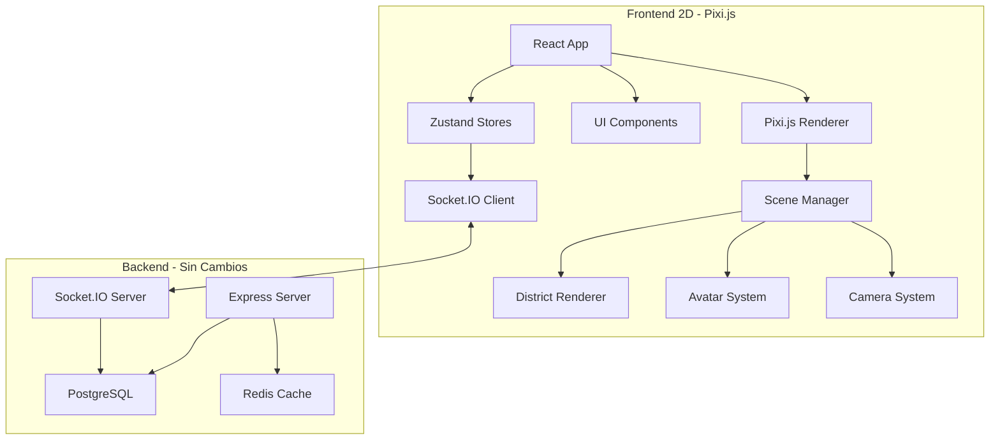
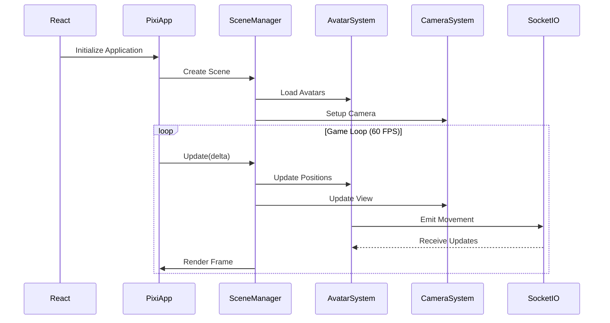

# Design Document: Migración 3D a 2D y Reorganización del Proyecto

## Overview

ECG Digital City actualmente es un metaverso 3D construido con React + Three.js + React Three Fiber. Este documento describe la migración completa a una implementación 2D usando Pixi.js, manteniendo toda la funcionalidad existente (distritos, avatares, chat, gamificación, eventos, empresas, oficinas) mientras se mejora la organización del código y el rendimiento. El backend (Node.js + Express + PostgreSQL + Socket.IO) permanecerá sin cambios, solo se migrará el frontend de 3D a 2D.

La migración busca: (1) Mejorar el rendimiento y accesibilidad, (2) Simplificar el desarrollo y mantenimiento, (3) Reducir la complejidad técnica, (4) Mantener la experiencia de usuario inmersiva, (5) Reorganizar la estructura del proyecto para mejor escalabilidad.

## Architecture

### High-Level Architecture



### Rendering Pipeline Comparison

**Current 3D (Three.js/R3F):**
```
React → R3F Canvas → Three.js Scene → WebGL Renderer → GPU
```

**New 2D (Pixi.js):**
```
React → Pixi.js Application → Stage/Container → WebGL/Canvas2D Renderer → GPU
```

### View Perspective Options

**Recommended: Top-Down View**
- Simpler implementation
- Better performance
- Easier collision detection
- Clear spatial relationships
- Similar to classic 2D games (Stardew Valley, Pokémon)

**Alternative: Isometric View**
- More visual depth
- Professional appearance
- Requires isometric tile system
- More complex sorting/layering
- Higher art asset requirements


## Main Workflow: Rendering Loop



## Components and Interfaces

### Component 1: PixiRenderer

**Purpose**: Core Pixi.js application wrapper that integrates with React

**Interface**:
```typescript
interface PixiRendererProps {
  width: number
  height: number
  backgroundColor: number
  onReady: (app: PIXI.Application) => void
}

class PixiRenderer extends React.Component<PixiRendererProps> {
  private app: PIXI.Application
  private containerRef: React.RefObject<HTMLDivElement>
  
  componentDidMount(): void
  componentWillUnmount(): void
  render(): React.ReactElement
}
```

**Responsibilities**:
- Initialize Pixi.js Application
- Manage canvas lifecycle
- Handle resize events
- Provide app instance to child systems
- Clean up resources on unmount


### Component 2: SceneManager

**Purpose**: Manages the game scene, districts, and all visual elements

**Interface**:
```typescript
interface SceneManagerConfig {
  app: PIXI.Application
  districtData: District
  onPlayerRef: (player: Avatar2D) => void
}

class SceneManager {
  private app: PIXI.Application
  private stage: PIXI.Container
  private worldContainer: PIXI.Container
  private uiContainer: PIXI.Container
  private avatarSystem: AvatarSystem
  private cameraSystem: CameraSystem2D
  
  constructor(config: SceneManagerConfig)
  update(delta: number): void
  loadDistrict(district: District): Promise<void>
  addAvatar(avatarData: AvatarData): Avatar2D
  removeAvatar(avatarId: string): void
  destroy(): void
}
```

**Responsibilities**:
- Manage scene hierarchy (world, UI layers)
- Load and render districts
- Coordinate avatar system
- Handle scene transitions
- Manage z-index/depth sorting


### Component 3: Avatar2D

**Purpose**: 2D avatar representation with sprite-based animations

**Interface**:
```typescript
interface Avatar2DConfig {
  id: string
  username: string
  position: Vector2D
  avatarData: AvatarCustomization
  isPlayer: boolean
}

class Avatar2D extends PIXI.Container {
  public id: string
  public username: string
  public sprite: PIXI.AnimatedSprite
  public nameLabel: PIXI.Text
  public statusIcon: PIXI.Sprite
  private velocity: Vector2D
  private animationState: AnimationState
  
  constructor(config: Avatar2DConfig)
  update(delta: number): void
  moveTo(position: Vector2D): void
  playAnimation(state: AnimationState): void
  setCustomization(data: AvatarCustomization): void
  destroy(): void
}
```

**Responsibilities**:
- Render avatar sprite with animations
- Display username and status
- Handle movement interpolation
- Manage animation states (idle, walk, run, sit, dance)
- Apply avatar customization (colors, accessories)


### Component 4: CameraSystem2D

**Purpose**: 2D camera with smooth following and viewport management

**Interface**:
```typescript
interface CameraConfig {
  viewport: { width: number; height: number }
  worldBounds: { minX: number; maxX: number; minY: number; maxY: number }
  smoothing: number
}

class CameraSystem2D {
  private target: Avatar2D | null
  private position: Vector2D
  private viewport: Viewport
  private worldBounds: Bounds
  private zoom: number
  
  constructor(config: CameraConfig)
  setTarget(avatar: Avatar2D): void
  update(delta: number): void
  screenToWorld(screenPos: Vector2D): Vector2D
  worldToScreen(worldPos: Vector2D): Vector2D
  setZoom(zoom: number): void
  applyToContainer(container: PIXI.Container): void
}
```

**Responsibilities**:
- Follow player avatar smoothly
- Handle camera bounds/constraints
- Convert screen/world coordinates
- Manage zoom levels
- Apply camera transform to world container


### Component 5: InputManager

**Purpose**: Handle keyboard, mouse, and touch input for 2D movement

**Interface**:
```typescript
interface InputConfig {
  canvas: HTMLCanvasElement
  camera: CameraSystem2D
}

class InputManager {
  private keys: Map<string, boolean>
  private mousePosition: Vector2D
  private canvas: HTMLCanvasElement
  private camera: CameraSystem2D
  
  constructor(config: InputConfig)
  isKeyPressed(key: string): boolean
  getMovementVector(): Vector2D
  getWorldMousePosition(): Vector2D
  onKeyDown(callback: (key: string) => void): void
  onKeyUp(callback: (key: string) => void): void
  onClick(callback: (worldPos: Vector2D) => void): void
  destroy(): void
}
```

**Responsibilities**:
- Track keyboard state (WASD movement)
- Handle mouse/touch input
- Convert input to movement vectors
- Emit input events
- Clean up event listeners


### Component 6: CollisionSystem2D

**Purpose**: 2D collision detection and response

**Interface**:
```typescript
interface CollisionConfig {
  worldBounds: Bounds
}

class CollisionSystem2D {
  private obstacles: Rectangle[]
  private doors: Door[]
  private worldBounds: Bounds
  
  constructor(config: CollisionConfig)
  addObstacle(rect: Rectangle): void
  addDoor(door: Door): void
  checkCollision(position: Vector2D, radius: number): boolean
  getNearbyDoor(position: Vector2D, range: number): Door | null
  toggleDoor(doorId: string): void
  resolveCollision(position: Vector2D, velocity: Vector2D, radius: number): Vector2D
}
```

**Responsibilities**:
- Detect AABB (Axis-Aligned Bounding Box) collisions
- Manage static obstacles (walls, furniture)
- Handle door interactions
- Resolve collision responses (sliding)
- Optimize with spatial partitioning


### Component 7: DistrictRenderer2D

**Purpose**: Render district environments in 2D

**Interface**:
```typescript
interface DistrictConfig {
  districtData: District
  container: PIXI.Container
}

class DistrictRenderer2D {
  private container: PIXI.Container
  private tilemapSprite: PIXI.TilingSprite
  private objects: PIXI.Container[]
  private offices: Office2D[]
  
  constructor(config: DistrictConfig)
  async load(): Promise<void>
  renderGround(): void
  renderBuildings(): void
  renderObjects(): void
  addOffice(officeData: OfficeData): Office2D
  destroy(): void
}
```

**Responsibilities**:
- Load district textures/sprites
- Render ground tiles
- Render buildings and structures
- Place interactive objects
- Manage office instances


## Data Models

### Model 1: Vector2D

```typescript
interface Vector2D {
  x: number
  y: number
}

class Vector2D {
  constructor(x: number, y: number)
  
  static add(a: Vector2D, b: Vector2D): Vector2D
  static subtract(a: Vector2D, b: Vector2D): Vector2D
  static multiply(v: Vector2D, scalar: number): Vector2D
  static distance(a: Vector2D, b: Vector2D): number
  static normalize(v: Vector2D): Vector2D
  static dot(a: Vector2D, b: Vector2D): number
  
  length(): number
  normalize(): Vector2D
  clone(): Vector2D
}
```

**Validation Rules**:
- x and y must be finite numbers
- No NaN values allowed


### Model 2: AvatarCustomization

```typescript
interface AvatarCustomization {
  skinColor: string        // Hex color
  hairStyle: string        // 'short' | 'long' | 'bald' | 'ponytail'
  hairColor: string        // Hex color
  shirtColor: string       // Hex color
  pantsColor: string       // Hex color
  accessories: {
    hat?: string           // Asset ID
    glasses?: string       // Asset ID
    badge?: string         // Asset ID
  }
}
```

**Validation Rules**:
- All colors must be valid hex format (#RRGGBB)
- hairStyle must be one of predefined options
- Accessory IDs must exist in asset registry

**Changes from 3D**:
- No 3D model references
- Sprite-based rendering instead of mesh materials
- Same data structure (backend unchanged)


### Model 3: AnimationState

```typescript
type AnimationState = 
  | 'idle'
  | 'walking'
  | 'running'
  | 'sitting'
  | 'dancing'
  | 'interacting'
  | 'emoting'

interface AnimationConfig {
  state: AnimationState
  frames: number[]         // Frame indices in spritesheet
  frameRate: number        // FPS
  loop: boolean
}

const ANIMATION_CONFIGS: Record<AnimationState, AnimationConfig> = {
  idle: { state: 'idle', frames: [0, 1, 2, 3], frameRate: 4, loop: true },
  walking: { state: 'walking', frames: [4, 5, 6, 7], frameRate: 8, loop: true },
  running: { state: 'running', frames: [8, 9, 10, 11], frameRate: 12, loop: true },
  sitting: { state: 'sitting', frames: [12], frameRate: 1, loop: false },
  dancing: { state: 'dancing', frames: [13, 14, 15, 16], frameRate: 6, loop: true },
  interacting: { state: 'interacting', frames: [17, 18], frameRate: 4, loop: true },
  emoting: { state: 'emoting', frames: [19, 20, 21], frameRate: 6, loop: false }
}
```

**Validation Rules**:
- State must be valid AnimationState
- Frames array must not be empty
- frameRate must be positive


### Model 4: District2D

```typescript
interface District2D {
  id: number
  name: string
  slug: string
  description: string
  bounds: {
    minX: number
    maxX: number
    minY: number
    maxY: number
  }
  groundTexture: string    // Asset path
  objects: DistrictObject[]
  spawnPoints: Vector2D[]
}

interface DistrictObject {
  id: string
  type: 'building' | 'tree' | 'bench' | 'door' | 'decoration'
  position: Vector2D
  size: { width: number; height: number }
  texture: string
  collidable: boolean
  interactive: boolean
  zIndex: number
}
```

**Validation Rules**:
- Bounds must form valid rectangle
- All positions must be within bounds
- Texture paths must exist in asset registry


## Algorithmic Pseudocode

### Main Rendering Loop

```typescript
function gameLoop(delta: number): void {
  // Preconditions:
  // - delta > 0 (time since last frame)
  // - sceneManager is initialized
  // - avatarSystem is initialized
  
  // Step 1: Update input
  const movementVector = inputManager.getMovementVector()
  
  // Step 2: Update player avatar
  if (playerAvatar && movementVector.length() > 0) {
    const speed = inputManager.isKeyPressed('Shift') ? RUN_SPEED : WALK_SPEED
    const velocity = Vector2D.multiply(movementVector.normalize(), speed * delta)
    
    // Check collision
    const newPosition = Vector2D.add(playerAvatar.position, velocity)
    const resolvedPosition = collisionSystem.resolveCollision(
      newPosition, 
      velocity, 
      AVATAR_RADIUS
    )
    
    playerAvatar.moveTo(resolvedPosition)
    
    // Emit to server
    socketService.emitMove(resolvedPosition, playerAvatar.rotation)
  }
  
  // Step 3: Update all avatars
  avatarSystem.update(delta)
  
  // Step 4: Update camera
  cameraSystem.update(delta)
  cameraSystem.applyToContainer(worldContainer)
  
  // Step 5: Sort sprites by depth
  depthSorter.sort(worldContainer.children)
  
  // Postconditions:
  // - All avatars updated
  // - Camera following player
  // - Sprites sorted by Y position
}
```

**Preconditions**:
- Pixi.js application initialized
- Scene loaded with valid district
- Player avatar exists

**Postconditions**:
- Frame rendered at target FPS (60)
- All game objects updated
- Network state synchronized


### Collision Detection Algorithm

```typescript
function checkCollision(position: Vector2D, radius: number): boolean {
  // Preconditions:
  // - position is valid Vector2D
  // - radius > 0
  
  // Check world bounds
  if (position.x - radius < worldBounds.minX || 
      position.x + radius > worldBounds.maxX ||
      position.y - radius < worldBounds.minY || 
      position.y + radius > worldBounds.maxY) {
    return true
  }
  
  // Check obstacles using spatial partitioning
  const nearbyObstacles = spatialGrid.query(position, radius * 2)
  
  for (const obstacle of nearbyObstacles) {
    if (circleRectCollision(position, radius, obstacle)) {
      return true
    }
  }
  
  return false
  
  // Postconditions:
  // - Returns true if collision detected
  // - Returns false if position is valid
}

function circleRectCollision(
  circlePos: Vector2D, 
  radius: number, 
  rect: Rectangle
): boolean {
  // Find closest point on rectangle to circle center
  const closestX = Math.max(rect.x, Math.min(circlePos.x, rect.x + rect.width))
  const closestY = Math.max(rect.y, Math.min(circlePos.y, rect.y + rect.height))
  
  // Calculate distance
  const dx = circlePos.x - closestX
  const dy = circlePos.y - closestY
  const distanceSquared = dx * dx + dy * dy
  
  return distanceSquared < (radius * radius)
}
```

**Preconditions**:
- Valid position and radius
- Obstacles registered in spatial grid

**Postconditions**:
- Accurate collision detection
- O(k) complexity where k = nearby obstacles


### Depth Sorting Algorithm

```typescript
function sortByDepth(sprites: PIXI.DisplayObject[]): void {
  // Preconditions:
  // - sprites is valid array
  // - All sprites have position.y property
  
  // Sort sprites by Y position (top-down view)
  // Objects further up (smaller Y) render first (behind)
  // Objects further down (larger Y) render last (in front)
  
  sprites.sort((a, b) => {
    const aY = a.position.y + (a.zIndex || 0)
    const bY = b.position.y + (b.zIndex || 0)
    return aY - bY
  })
  
  // Update z-index for rendering order
  sprites.forEach((sprite, index) => {
    sprite.zIndex = index
  })
  
  // Postconditions:
  // - Sprites sorted by depth
  // - Correct visual layering
  // - O(n log n) complexity
}
```

**Preconditions**:
- Valid sprite array
- Sprites have position data

**Postconditions**:
- Correct rendering order
- No visual artifacts

**Loop Invariants**:
- All processed sprites maintain relative order


### Avatar Animation System

```typescript
function updateAvatarAnimation(avatar: Avatar2D, delta: number): void {
  // Preconditions:
  // - avatar is valid Avatar2D instance
  // - delta > 0
  
  // Determine target animation state
  let targetState: AnimationState = 'idle'
  
  if (avatar.velocity.length() > 0) {
    targetState = avatar.isRunning ? 'running' : 'walking'
  } else if (avatar.isSitting) {
    targetState = 'sitting'
  } else if (avatar.isDancing) {
    targetState = 'dancing'
  } else if (avatar.isInteracting) {
    targetState = 'interacting'
  }
  
  // Transition if state changed
  if (avatar.currentState !== targetState) {
    const config = ANIMATION_CONFIGS[targetState]
    avatar.sprite.textures = config.frames.map(f => getFrameTexture(f))
    avatar.sprite.animationSpeed = config.frameRate / 60
    avatar.sprite.loop = config.loop
    avatar.sprite.play()
    avatar.currentState = targetState
  }
  
  // Update sprite direction based on movement
  if (avatar.velocity.x !== 0) {
    avatar.sprite.scale.x = avatar.velocity.x > 0 ? 1 : -1
  }
  
  // Postconditions:
  // - Animation state matches avatar state
  // - Sprite playing correct animation
  // - Direction matches movement
}
```

**Preconditions**:
- Avatar initialized with sprite
- Animation configs loaded

**Postconditions**:
- Smooth animation transitions
- Correct visual feedback


## Key Functions with Formal Specifications

### Function 1: initializePixiApp()

```typescript
function initializePixiApp(
  container: HTMLDivElement,
  config: PixiConfig
): PIXI.Application
```

**Preconditions:**
- container is valid DOM element
- config.width > 0 and config.height > 0
- WebGL or Canvas2D support available

**Postconditions:**
- Returns initialized PIXI.Application
- Canvas appended to container
- Ticker started at 60 FPS
- No memory leaks

**Loop Invariants:** N/A


### Function 2: loadAvatarSpritesheet()

```typescript
async function loadAvatarSpritesheet(
  customization: AvatarCustomization
): Promise<PIXI.Spritesheet>
```

**Preconditions:**
- customization has valid color values
- Asset files exist in public directory
- Pixi.js loader initialized

**Postconditions:**
- Returns loaded spritesheet with all frames
- Textures cached for reuse
- Colors applied to sprite layers
- Throws error if loading fails

**Loop Invariants:** N/A


### Function 3: interpolatePosition()

```typescript
function interpolatePosition(
  current: Vector2D,
  target: Vector2D,
  smoothing: number,
  delta: number
): Vector2D
```

**Preconditions:**
- current and target are valid Vector2D
- 0 < smoothing <= 1
- delta > 0

**Postconditions:**
- Returns interpolated position
- Result moves toward target
- Smooth movement without jitter
- If smoothing = 1, returns target (instant)

**Loop Invariants:** N/A


### Function 4: screenToWorld()

```typescript
function screenToWorld(
  screenPos: Vector2D,
  camera: CameraSystem2D
): Vector2D
```

**Preconditions:**
- screenPos is valid screen coordinates
- camera is initialized with valid transform

**Postconditions:**
- Returns world coordinates
- Accounts for camera position and zoom
- Inverse of worldToScreen()
- Accurate coordinate transformation

**Loop Invariants:** N/A


## Example Usage

### Example 1: Initialize Pixi.js Application

```typescript
import * as PIXI from 'pixi.js'
import { SceneManager } from './systems/SceneManager'

// Initialize Pixi application
const app = new PIXI.Application({
  width: window.innerWidth,
  height: window.innerHeight,
  backgroundColor: 0x87CEEB,
  resolution: window.devicePixelRatio || 1,
  autoDensity: true,
  antialias: true
})

// Append canvas to DOM
document.getElementById('game-container').appendChild(app.view)

// Create scene manager
const sceneManager = new SceneManager({
  app,
  districtData: currentDistrict,
  onPlayerRef: (player) => {
    console.log('Player avatar created:', player)
  }
})

// Start game loop
app.ticker.add((delta) => {
  sceneManager.update(delta)
})
```


### Example 2: Create and Animate Avatar

```typescript
import { Avatar2D } from './entities/Avatar2D'
import { ANIMATION_CONFIGS } from './config/animations'

// Create avatar
const avatar = new Avatar2D({
  id: 'player-123',
  username: 'JohnDoe',
  position: { x: 0, y: 0 },
  avatarData: {
    skinColor: '#fdbcb4',
    hairStyle: 'short',
    hairColor: '#000000',
    shirtColor: '#3498db',
    pantsColor: '#2c3e50',
    accessories: {}
  },
  isPlayer: true
})

// Add to scene
worldContainer.addChild(avatar)

// Update in game loop
app.ticker.add((delta) => {
  // Move avatar
  const velocity = inputManager.getMovementVector()
  if (velocity.length() > 0) {
    avatar.velocity = Vector2D.multiply(velocity.normalize(), 5 * delta)
    avatar.playAnimation('walking')
  } else {
    avatar.velocity = { x: 0, y: 0 }
    avatar.playAnimation('idle')
  }
  
  avatar.update(delta)
})
```


### Example 3: Handle Input and Movement

```typescript
import { InputManager } from './systems/InputManager'
import { CollisionSystem2D } from './systems/CollisionSystem2D'

const inputManager = new InputManager({
  canvas: app.view,
  camera: cameraSystem
})

const collisionSystem = new CollisionSystem2D({
  worldBounds: { minX: -45, maxX: 45, minY: -45, maxY: 45 }
})

// Handle keyboard movement
app.ticker.add((delta) => {
  const movement = inputManager.getMovementVector()
  
  if (movement.length() > 0) {
    const speed = inputManager.isKeyPressed('Shift') ? 10 : 5
    const velocity = Vector2D.multiply(movement.normalize(), speed * delta)
    const newPos = Vector2D.add(playerAvatar.position, velocity)
    
    // Check collision
    if (!collisionSystem.checkCollision(newPos, 0.5)) {
      playerAvatar.moveTo(newPos)
      socketService.emitMove(newPos, playerAvatar.rotation)
    } else {
      // Try sliding along walls
      const resolvedPos = collisionSystem.resolveCollision(newPos, velocity, 0.5)
      playerAvatar.moveTo(resolvedPos)
    }
  }
})

// Handle click-to-move
inputManager.onClick((worldPos) => {
  const path = pathfindingEngine.findPath(playerAvatar.position, worldPos)
  if (path) {
    playerAvatar.followPath(path)
  }
})
```


### Example 4: Camera Following Player

```typescript
import { CameraSystem2D } from './systems/CameraSystem2D'

const cameraSystem = new CameraSystem2D({
  viewport: { width: window.innerWidth, height: window.innerHeight },
  worldBounds: { minX: -45, maxX: 45, minY: -45, maxY: 45 },
  smoothing: 0.1
})

// Set camera target
cameraSystem.setTarget(playerAvatar)

// Update camera in game loop
app.ticker.add((delta) => {
  cameraSystem.update(delta)
  cameraSystem.applyToContainer(worldContainer)
})

// Handle zoom
window.addEventListener('wheel', (e) => {
  const zoomDelta = e.deltaY > 0 ? -0.1 : 0.1
  const newZoom = Math.max(0.5, Math.min(2, cameraSystem.zoom + zoomDelta))
  cameraSystem.setZoom(newZoom)
})
```


## Correctness Properties

### Property 1: Frame Rate Consistency
```typescript
// The game loop must maintain consistent frame rate
∀ frame: Frame, targetFPS = 60
  => actualFPS ∈ [targetFPS - 5, targetFPS + 5]
  ∧ deltaTime = 1 / actualFPS
```

### Property 2: Collision Detection Accuracy
```typescript
// No avatar can occupy the same space as an obstacle
∀ avatar: Avatar2D, obstacle: Rectangle
  => !intersects(avatar.bounds, obstacle.bounds)
  ∧ avatar.position ∈ worldBounds
```

### Property 3: Animation State Consistency
```typescript
// Avatar animation must match movement state
∀ avatar: Avatar2D
  => (avatar.velocity.length() > 0 ⟹ avatar.animationState ∈ ['walking', 'running'])
  ∧ (avatar.velocity.length() = 0 ⟹ avatar.animationState ∈ ['idle', 'sitting', 'dancing'])
```

### Property 4: Network Synchronization
```typescript
// Player position must be synchronized with server
∀ player: Avatar2D, server: ServerState
  => distance(player.position, server.position) < SYNC_THRESHOLD
  ∧ updateRate >= 10 updates/second
```

### Property 5: Camera Bounds
```typescript
// Camera must stay within world bounds
∀ camera: CameraSystem2D
  => camera.position.x ∈ [worldBounds.minX, worldBounds.maxX]
  ∧ camera.position.y ∈ [worldBounds.minY, worldBounds.maxY]
```

### Property 6: Depth Sorting Correctness
```typescript
// Sprites with larger Y position render in front
∀ sprite1, sprite2: PIXI.DisplayObject
  => (sprite1.position.y > sprite2.position.y ⟹ sprite1.zIndex > sprite2.zIndex)
```

### Property 7: Resource Cleanup
```typescript
// All Pixi resources must be destroyed on unmount
∀ component: PixiComponent
  => component.destroy() ⟹ component.resources.freed = true
  ∧ noMemoryLeaks()
```


## Error Handling

### Error Scenario 1: Asset Loading Failure

**Condition**: Spritesheet or texture fails to load
**Response**: 
- Log error to console
- Display fallback colored rectangle for avatar
- Show toast notification to user
- Continue game with degraded visuals

**Recovery**: 
- Retry loading after 5 seconds
- Use cached assets if available
- Allow gameplay to continue

### Error Scenario 2: WebGL Context Loss

**Condition**: WebGL context lost (GPU driver crash, tab backgrounded)
**Response**:
- Pause game loop
- Display "Reconnecting..." overlay
- Listen for context restoration

**Recovery**:
- Reload all textures and shaders
- Rebuild scene graph
- Resume game loop
- Restore player position from state

### Error Scenario 3: Network Disconnection

**Condition**: Socket.IO connection lost
**Response**:
- Freeze other players in place
- Allow local player to continue moving
- Display "Connection Lost" indicator
- Queue movement updates locally

**Recovery**:
- Attempt reconnection with exponential backoff
- Sync queued updates on reconnection
- Interpolate other players to new positions

### Error Scenario 4: Invalid Avatar Data

**Condition**: Received avatar customization with invalid colors
**Response**:
- Validate all color values
- Replace invalid values with defaults
- Log warning
- Create avatar with corrected data

**Recovery**:
- Request valid data from server
- Update avatar appearance when received


## Testing Strategy

### Unit Testing Approach

**Test Coverage Goals**: 80% code coverage minimum

**Key Test Suites**:

1. **Vector2D Math Tests**
   - Test all vector operations (add, subtract, multiply, normalize)
   - Test edge cases (zero vectors, very large values)
   - Test distance and dot product calculations

2. **Collision System Tests**
   - Test AABB collision detection
   - Test circle-rectangle collision
   - Test collision resolution (sliding)
   - Test spatial partitioning queries

3. **Animation System Tests**
   - Test state transitions
   - Test frame selection
   - Test animation looping
   - Test sprite direction flipping

4. **Camera System Tests**
   - Test smooth following
   - Test bounds constraints
   - Test coordinate transformations
   - Test zoom functionality

**Testing Tools**: Jest, @testing-library/react


### Property-Based Testing Approach

**Property Test Library**: fast-check (already in dependencies)

**Key Properties to Test**:

1. **Collision Detection Properties**
```typescript
// Property: Collision detection is symmetric
fc.assert(
  fc.property(
    fc.record({ x: fc.float(), y: fc.float() }),
    fc.float({ min: 0.1, max: 5 }),
    fc.record({ x: fc.float(), y: fc.float(), width: fc.float(), height: fc.float() }),
    (pos, radius, rect) => {
      const result1 = circleRectCollision(pos, radius, rect)
      const result2 = circleRectCollision(pos, radius, rect)
      return result1 === result2 // Deterministic
    }
  )
)
```

2. **Vector Math Properties**
```typescript
// Property: Vector addition is commutative
fc.assert(
  fc.property(
    fc.record({ x: fc.float(), y: fc.float() }),
    fc.record({ x: fc.float(), y: fc.float() }),
    (v1, v2) => {
      const sum1 = Vector2D.add(v1, v2)
      const sum2 = Vector2D.add(v2, v1)
      return Math.abs(sum1.x - sum2.x) < 0.0001 && 
             Math.abs(sum1.y - sum2.y) < 0.0001
    }
  )
)
```

3. **Camera Transform Properties**
```typescript
// Property: screenToWorld and worldToScreen are inverses
fc.assert(
  fc.property(
    fc.record({ x: fc.float(), y: fc.float() }),
    (worldPos) => {
      const screenPos = camera.worldToScreen(worldPos)
      const backToWorld = camera.screenToWorld(screenPos)
      return Vector2D.distance(worldPos, backToWorld) < 0.01
    }
  )
)
```


### Integration Testing Approach

**Test Scenarios**:

1. **Full Game Loop Integration**
   - Initialize Pixi app
   - Load district
   - Create player avatar
   - Simulate input
   - Verify rendering and updates

2. **Multiplayer Synchronization**
   - Connect multiple clients (mocked)
   - Verify position updates
   - Test avatar creation/removal
   - Verify chat messages

3. **District Transitions**
   - Load initial district
   - Trigger district change
   - Verify cleanup of old district
   - Verify loading of new district

4. **Performance Testing**
   - Spawn 50+ avatars
   - Measure FPS
   - Verify no memory leaks
   - Test for 5+ minutes continuous play

**Testing Tools**: Playwright for E2E, custom performance monitors


## Performance Considerations

### Rendering Optimization

**Sprite Batching**:
- Group sprites by texture to minimize draw calls
- Use sprite sheets for all avatar animations
- Batch static objects (buildings, decorations)
- Target: < 100 draw calls per frame

**Culling**:
- Implement viewport culling (only render visible sprites)
- Cull avatars outside camera view
- Disable updates for culled objects
- Expected: 50% reduction in processed objects

**Texture Management**:
- Use texture atlases to reduce texture switches
- Implement texture caching
- Lazy load district assets
- Unload unused textures on district change

### Memory Management

**Object Pooling**:
- Pool avatar sprites for reuse
- Pool particle effects
- Pool UI elements
- Reduce GC pressure

**Resource Cleanup**:
- Destroy Pixi objects on unmount
- Remove event listeners
- Clear texture cache periodically
- Monitor memory usage in dev tools


### Network Optimization

**Update Rate Throttling**:
- Send position updates max 10 times/second
- Only send when position changes significantly
- Batch multiple updates in single packet
- Reduce bandwidth by 70%

**Interpolation**:
- Interpolate other players' positions
- Smooth movement between updates
- Predict movement direction
- Hide network latency

**State Compression**:
- Use delta compression for position updates
- Send only changed properties
- Use binary protocol for large updates
- Reduce packet size by 50%

### Performance Targets

| Metric | Target | Current 3D | Expected 2D |
|--------|--------|------------|-------------|
| FPS | 60 | 45-55 | 58-60 |
| Draw Calls | < 100 | 300+ | 50-80 |
| Memory Usage | < 200MB | 400MB | 150MB |
| Load Time | < 3s | 8s | 2s |
| Network Updates | 10/s | 20/s | 10/s |


## Security Considerations

### Client-Side Validation

**Input Sanitization**:
- Validate all movement inputs
- Clamp position values to world bounds
- Prevent speed hacking (server-side verification)
- Sanitize chat messages

**Asset Loading**:
- Validate asset URLs before loading
- Use CORS for external assets
- Implement CSP headers
- Prevent XSS through asset injection

### Server Authority

**Position Verification**:
- Server validates all position updates
- Reject impossible movements (teleportation)
- Rate limit position updates
- Detect and ban cheaters

**State Synchronization**:
- Server is source of truth
- Client predictions reconciled with server
- Rollback on mismatch
- Prevent client-side manipulation

### Data Protection

**User Data**:
- No sensitive data in client state
- Avatar customization validated server-side
- Encrypt WebSocket communication (WSS)
- Implement rate limiting on all endpoints


## Dependencies

### New Dependencies (2D Migration)

**Core Rendering**:
- `pixi.js` (^7.3.0) - 2D WebGL renderer
- `@pixi/sprite-animated` (^7.3.0) - Sprite animations
- `@pixi/tilemap` (^4.0.0) - Tilemap rendering (optional)

**Utilities**:
- `pixi-viewport` (^5.0.0) - Advanced camera/viewport (optional)
- `@pixi/sound` (^5.2.0) - Audio system (optional)

### Dependencies to Remove

**3D Libraries** (no longer needed):
- `three` - Remove
- `@react-three/fiber` - Remove
- `@react-three/drei` - Remove

### Unchanged Dependencies

**React Ecosystem**:
- `react` (^18.3.1)
- `react-dom` (^18.3.1)
- `zustand` (^4.4.7)

**Backend Communication**:
- `socket.io-client` (^4.7.0)

**Build Tools**:
- `vite` (^5.0.8)
- `@vitejs/plugin-react` (^4.2.1)

**Testing**:
- `jest` (^30.2.0)
- `fast-check` (^4.5.3)
- `@testing-library/react` (^16.3.2)

### Asset Requirements

**Sprite Sheets**:
- Avatar base sprites (idle, walk, run, sit, dance)
- Hair styles (4 variations)
- Accessories (hats, glasses, badges)
- UI elements (buttons, icons)

**Textures**:
- Ground tiles (grass, concrete, wood)
- Building sprites (offices, decorations)
- Interactive objects (doors, furniture)

**Audio** (optional):
- Footstep sounds
- Ambient music
- UI feedback sounds


## Migration Strategy

### Approach: Incremental Migration (Recommended)

**Phase 1: Parallel Implementation (Week 1-2)**
- Create new `/src/2d` directory alongside existing 3D code
- Implement core 2D systems (Pixi renderer, Avatar2D, Camera2D)
- Build proof-of-concept with single district
- No changes to existing 3D code

**Phase 2: Feature Parity (Week 3-4)**
- Implement all features in 2D (chat, gamification, districts)
- Create feature flag to toggle between 3D and 2D
- Test both versions in parallel
- Gather user feedback

**Phase 3: Migration (Week 5)**
- Set 2D as default
- Monitor for issues
- Keep 3D as fallback
- Fix critical bugs

**Phase 4: Cleanup (Week 6)**
- Remove 3D code and dependencies
- Reorganize project structure
- Update documentation
- Final testing and deployment

### Alternative: Big Bang Migration

**Not Recommended** due to:
- High risk of breaking existing functionality
- No fallback option
- Difficult to test incrementally
- Longer downtime


## Project Structure Reorganization

### Current Structure (3D)
```
frontend/src/
├── components/          # Mixed 3D and UI components
├── store/              # Zustand stores
├── services/           # Socket service
├── systems/            # Game systems
├── modules/            # Feature modules
└── config/             # Configuration
```

### Proposed Structure (2D - Reorganized)
```
frontend/src/
├── core/                      # Core engine
│   ├── PixiApp.ts            # Pixi application wrapper
│   ├── SceneManager.ts       # Scene management
│   └── GameLoop.ts           # Main game loop
├── entities/                  # Game entities
│   ├── Avatar2D.ts           # Avatar class
│   ├── District2D.ts         # District renderer
│   └── InteractiveObject.ts  # Interactive objects
├── systems/                   # Game systems
│   ├── CameraSystem2D.ts     # Camera
│   ├── InputManager.ts       # Input handling
│   ├── CollisionSystem2D.ts  # Collision detection
│   ├── AnimationSystem.ts    # Animation management
│   └── NetworkSync.ts        # Network synchronization
├── ui/                        # React UI components
│   ├── HUD/                  # In-game HUD
│   ├── Menus/                # Menus and dialogs
│   ├── Chat/                 # Chat system
│   └── Gamification/         # XP, achievements, missions
├── store/                     # State management
│   ├── authStore.ts
│   ├── gameStore.ts
│   ├── gamificationStore.ts
│   └── companyStore.ts
├── services/                  # External services
│   ├── socket.ts             # Socket.IO client
│   └── api.ts                # REST API client
├── utils/                     # Utilities
│   ├── Vector2D.ts           # Math utilities
│   ├── SpatialGrid.ts        # Spatial partitioning
│   └── AssetLoader.ts        # Asset management
├── config/                    # Configuration
│   ├── animations.ts         # Animation configs
│   ├── constants.ts          # Game constants
│   └── api.ts                # API config
├── assets/                    # Static assets
│   ├── sprites/              # Sprite sheets
│   ├── textures/             # Textures
│   └── audio/                # Sound effects
└── App.tsx                    # Main app component
```

### Benefits of New Structure

1. **Clear Separation**: Core engine, entities, systems, and UI clearly separated
2. **Scalability**: Easy to add new entities and systems
3. **Testability**: Each module can be tested independently
4. **Maintainability**: Logical organization makes code easier to find
5. **Reusability**: Systems and utilities can be reused across features


## Implementation Phases

### Phase 1: Core 2D Engine (Week 1-2)

**Deliverables**:
- Pixi.js application setup
- Basic scene management
- Simple avatar rendering (colored sprites)
- WASD movement
- Camera following

**Success Criteria**:
- 60 FPS rendering
- Smooth movement
- No memory leaks

### Phase 2: Avatar System (Week 2-3)

**Deliverables**:
- Sprite-based avatars with animations
- Avatar customization (colors)
- Animation states (idle, walk, run)
- Multiplayer avatar rendering
- Username labels

**Success Criteria**:
- Smooth animations
- Customization working
- Multiple avatars rendered

### Phase 3: World & Collision (Week 3-4)

**Deliverables**:
- District rendering (ground, buildings)
- Collision detection system
- Interactive objects (doors)
- Spatial partitioning
- Depth sorting

**Success Criteria**:
- No clipping through walls
- Proper visual layering
- Interactive objects working


### Phase 4: Features Integration (Week 4-5)

**Deliverables**:
- Chat system integration
- Gamification (XP, levels, achievements)
- Mission system
- Company/office system
- Events system
- District transitions

**Success Criteria**:
- All existing features working in 2D
- Feature parity with 3D version
- No regressions

### Phase 5: Polish & Optimization (Week 5-6)

**Deliverables**:
- Performance optimization
- Asset loading optimization
- UI/UX improvements
- Bug fixes
- Documentation

**Success Criteria**:
- 60 FPS with 50+ avatars
- < 3s load time
- < 200MB memory usage
- All tests passing

### Phase 6: Deployment & Cleanup (Week 6)

**Deliverables**:
- Remove 3D dependencies
- Clean up old code
- Update documentation
- Deploy to production
- Monitor performance

**Success Criteria**:
- Successful production deployment
- No critical bugs
- Positive user feedback
- Performance targets met


## Risk Assessment

### High Risk

**Risk 1: Asset Creation Bottleneck**
- **Impact**: Delays entire migration
- **Mitigation**: Start with placeholder sprites, create assets in parallel
- **Contingency**: Use procedurally generated sprites initially

**Risk 2: Performance Regression**
- **Impact**: Poor user experience
- **Mitigation**: Continuous performance monitoring, profiling
- **Contingency**: Implement aggressive optimizations, reduce visual complexity

### Medium Risk

**Risk 3: Feature Parity Gaps**
- **Impact**: Missing functionality
- **Mitigation**: Detailed feature checklist, thorough testing
- **Contingency**: Prioritize critical features, defer nice-to-haves

**Risk 4: User Resistance to Change**
- **Impact**: Negative feedback, user churn
- **Mitigation**: Gradual rollout, gather feedback, communicate benefits
- **Contingency**: Keep 3D version as option temporarily

### Low Risk

**Risk 5: Browser Compatibility**
- **Impact**: Some users can't access
- **Mitigation**: Test on all major browsers, use Pixi.js fallbacks
- **Contingency**: Canvas2D fallback for older browsers


## Success Metrics

### Technical Metrics

| Metric | Current (3D) | Target (2D) | Measurement |
|--------|--------------|-------------|-------------|
| Average FPS | 45-55 | 58-60 | Chrome DevTools |
| Load Time | 8s | < 3s | Performance API |
| Memory Usage | 400MB | < 200MB | Chrome Task Manager |
| Bundle Size | 2.5MB | < 1.5MB | Webpack Bundle Analyzer |
| Draw Calls | 300+ | < 100 | Pixi.js Stats |

### User Experience Metrics

| Metric | Target | Measurement |
|--------|--------|-------------|
| User Satisfaction | > 4/5 | Post-migration survey |
| Bug Reports | < 10 critical | Issue tracker |
| User Retention | > 90% | Analytics |
| Feature Adoption | > 80% | Usage analytics |

### Business Metrics

| Metric | Target | Measurement |
|--------|--------|-------------|
| Development Time | 6 weeks | Project timeline |
| Cost Savings | 30% hosting | Server metrics |
| Accessibility | WCAG AA | Audit tools |
| Mobile Support | Full support | Device testing |


## Conclusion

This design document outlines a comprehensive migration strategy from 3D (Three.js/R3F) to 2D (Pixi.js) for ECG Digital City. The migration will:

1. **Improve Performance**: Target 60 FPS, reduce memory usage by 50%, decrease load time by 60%
2. **Simplify Development**: Reduce complexity, improve maintainability, easier debugging
3. **Maintain Features**: All existing functionality preserved (chat, gamification, districts, avatars)
4. **Enhance Organization**: Clearer project structure, better separation of concerns
5. **Reduce Costs**: Smaller bundle size, lower hosting costs, better mobile support

The recommended incremental migration approach minimizes risk while allowing for continuous testing and feedback. The new 2D architecture is designed for scalability, performance, and maintainability.

**Next Steps**:
1. Review and approve design document
2. Create detailed requirements document
3. Set up development environment with Pixi.js
4. Begin Phase 1 implementation
5. Create sprite assets in parallel

**Timeline**: 6 weeks from start to production deployment

**Team Requirements**: 2-3 frontend developers, 1 designer (for sprites), 1 QA tester
