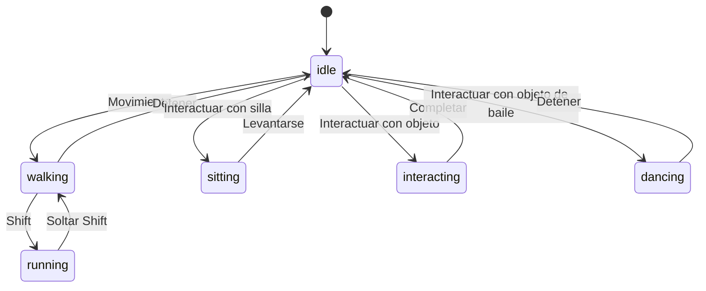

# Documento de Diseño: Sistema de Interacciones Avanzadas

## Introducción

Este documento describe el diseño técnico del Sistema de Interacciones Avanzadas para ECG Digital City, un sistema integral que transforma el mundo virtual básico en una plataforma metaverso corporativa completa con objetos interactivos, estados de avatar, navegación inteligente y gestión de profundidad visual.

El sistema se compone de cinco subsistemas principales que trabajan en conjunto:
- **Sistema_Objetos_Interactivos**: Gestión de objetos del mundo con estados y comportamientos
- **Sistema_Estados_Avatar**: Control de estados visuales y comportamentales del avatar
- **Sistema_Pathfinding**: Navegación inteligente con algoritmo A*
- **Sistema_Profundidad**: Ordenamiento visual basado en eje Y
- **Sistema_Interaccion**: Procesamiento de interacciones usuario-objeto

## Overview

### Arquitectura de Alto Nivel

El sistema sigue una arquitectura cliente-servidor con sincronización en tiempo real:

```
┌─────────────────────────────────────────────────────────────┐
│                        FRONTEND                              │
│  ┌──────────────┐  ┌──────────────┐  ┌──────────────┐      │
│  │   Sistema    │  │   Sistema    │  │   Sistema    │      │
│  │  Pathfinding │  │ Profundidad  │  │ Interaccion  │      │
│  └──────┬───────┘  └──────┬───────┘  └──────┬───────┘      │
│         │                  │                  │              │
│         └──────────────────┴──────────────────┘              │
│                            │                                 │
│                   ┌────────▼────────┐                        │
│                   │  Sistema_Estados │                       │
│                   │     Avatar       │                       │
│                   └────────┬────────┘                        │
│                            │                                 │
│                   ┌────────▼────────┐                        │
│                   │   Zustand Store  │                       │
│                   └────────┬────────┘                        │
└────────────────────────────┼──────────────────────────────────┘
                             │
                    ┌────────▼────────┐
                    │   Socket.IO     │
                    └────────┬────────┘
┌────────────────────────────┼──────────────────────────────────┐
│                        BACKEND                               │
│                   ┌────────▼────────┐                        │
│                   │  Socket Handler  │                       │
│                   └────────┬────────┘                        │
│         │                  │                  │              │
│  ┌──────▼──────────────────▼──────────────────▼──────┐      │
│  │      Sistema_Objetos_Interactivos Service         │      │
│  └──────┬─────────────────────────────────────────────┘      │
│         │                                                     │
│  ┌──────▼──────────────────────────────────────────┐        │
│  │           PostgreSQL Database                    │        │
│  │  - InteractiveObjects                            │        │
│  │  - InteractionNodes                              │        │
│  │  - ObjectStates                                  │        │
│  │  - InteractionQueue                              │        │
│  │  - InteractionLogs                               │        │
│  └──────────────────────────────────────────────────┘        │
└─────────────────────────────────────────────────────────────┘
```

### Flujo de Datos Principal

1. **Interacción Iniciada**: Usuario hace click en objeto o presiona tecla E
2. **Detección**: Sistema_Interaccion detecta objeto y verifica proximidad
3. **Pathfinding**: Si está lejos, Sistema_Pathfinding calcula ruta
4. **Movimiento**: Avatar se mueve siguiendo la ruta calculada
5. **Ejecución**: Al llegar, Sistema_Interaccion ejecuta la interacción
6. **Cambio de Estado**: Sistema_Estados_Avatar actualiza estado del avatar
7. **Sincronización**: Socket.IO propaga cambios a todos los clientes
8. **Renderizado**: Sistema_Profundidad actualiza orden de renderizado

### Tecnologías y Librerías

**Backend:**
- Node.js 18+ con Express
- PostgreSQL 14+ con Sequelize ORM
- Socket.IO 4.x para comunicación en tiempo real
- bcryptjs para seguridad

**Frontend:**
- React 18 con React Three Fiber para renderizado 3D
- Three.js para gráficos 3D
- Zustand para gestión de estado
- Socket.IO Client para comunicación en tiempo real
- @react-three/drei para helpers 3D

**Algoritmos:**
- A* (A-Star) para pathfinding
- Spatial hashing para optimización de colisiones
- Y-axis sorting para depth ordering

## Architecture

### Subsistema: Sistema_Objetos_Interactivos

**Responsabilidad**: Gestionar el ciclo de vida completo de objetos interactivos en el mundo virtual.

**Componentes:**

1. **InteractiveObjectService** (Backend)
   - CRUD de objetos interactivos
   - Gestión de estados de objetos
   - Ejecución de triggers
   - Persistencia en base de datos

2. **InteractiveObjectManager** (Frontend)
   - Caché local de objetos
   - Sincronización con servidor
   - Renderizado de objetos 3D

**Flujo de Datos:**
```
Usuario Admin → API REST → InteractiveObjectService → PostgreSQL
                              ↓
                         Socket.IO Broadcast
                              ↓
                    Todos los Clientes → InteractiveObjectManager
```

### Subsistema: Sistema_Estados_Avatar

**Responsabilidad**: Controlar y sincronizar estados visuales y comportamentales de avatares.

**Estados Soportados:**
- `idle`: Avatar en reposo
- `walking`: Avatar caminando
- `running`: Avatar corriendo (walking + shift)
- `sitting`: Avatar sentado en objeto
- `interacting`: Avatar ejecutando interacción
- `dancing`: Avatar bailando

**Máquina de Estados:**


**Componentes:**

1. **AvatarStateManager** (Frontend)
   - Gestión de máquina de estados
   - Transiciones animadas
   - Validación de transiciones

2. **AvatarStateSync** (Backend)
   - Validación de cambios de estado
   - Broadcast a clientes
   - Persistencia de estado actual

### Subsistema: Sistema_Pathfinding

**Responsabilidad**: Calcular rutas óptimas para navegación click-to-move.

**Algoritmo A* (A-Star):**

El algoritmo A* encuentra el camino más corto entre dos puntos usando una función heurística:

```
f(n) = g(n) + h(n)

donde:
- f(n) = costo total estimado del nodo n
- g(n) = costo real desde el inicio hasta n
- h(n) = costo heurístico estimado desde n hasta el objetivo
```

**Heurística**: Distancia Euclidiana para movimiento en plano 2D (X, Z)

```javascript
h(n) = Math.sqrt((n.x - goal.x)² + (n.z - goal.z)²)
```

**Componentes:**

1. **PathfindingEngine** (Frontend)
   - Implementación de A*
   - Gestión de malla de navegación
   - Detección de obstáculos
   - Interpolación de rutas

2. **NavigationMesh**
   - Grid-based navigation mesh
   - Tamaño de celda: 0.5 unidades
   - Marcado de celdas transitables/bloqueadas

**Optimizaciones:**
- Early exit cuando se encuentra el objetivo
- Límite de iteraciones (1000) para prevenir loops infinitos
- Path simplification para reducir waypoints
- Catmull-Rom spline para suavizado de curvas

### Subsistema: Sistema_Profundidad

**Responsabilidad**: Ordenar elementos visuales según su posición en el eje Y para perspectiva correcta.

**Algoritmo de Ordenamiento:**

```javascript
zIndex = BASE_Z_INDEX - (yPosition * DEPTH_FACTOR)

donde:
- BASE_Z_INDEX = 1000 (valor base)
- DEPTH_FACTOR = 10 (multiplicador de profundidad)
- yPosition = coordenada Y del objeto
```

**Ejemplo:**
- Objeto en Y=0 (fondo): zIndex = 1000 - (0 * 10) = 1000
- Objeto en Y=5: zIndex = 1000 - (5 * 10) = 950
- Objeto en Y=10 (frente): zIndex = 1000 - (10 * 10) = 900

**Componentes:**

1. **DepthSorter** (Frontend)
   - Cálculo de z-index en cada frame
   - Detección de cambios de posición
   - Actualización de renderOrder en Three.js

2. **SpatialPartitioner**
   - División del mundo en sectores
   - Solo compara objetos en sectores cercanos
   - Reduce complejidad de O(n²) a O(n log n)

**Optimizaciones:**
- Dirty flag para objetos que cambiaron posición
- Caché de z-index para objetos estáticos
- Batch updates cada frame
- Spatial hashing para reducir comparaciones

### Subsistema: Sistema_Interaccion

**Responsabilidad**: Procesar y ejecutar interacciones entre usuarios y objetos.

**Tipos de Interacción:**

1. **Click Interaction**
   - Raycasting desde cámara
   - Detección de objeto clickeado
   - Verificación de rango
   - Pathfinding si está lejos

2. **Key Interaction (E)**
   - Búsqueda de objetos cercanos (radio 2 unidades)
   - Selección del más cercano
   - Ejecución inmediata

**Componentes:**

1. **InteractionHandler** (Frontend)
   - Detección de input (click/tecla)
   - Raycasting para clicks
   - Proximity detection para tecla E
   - Feedback visual (highlights)

2. **InteractionExecutor** (Backend)
   - Validación de permisos
   - Ejecución de triggers
   - Actualización de estados
   - Otorgamiento de XP
   - Gestión de colas

3. **InteractionQueue**
   - Cola FIFO para objetos ocupados
   - Notificación cuando se libera
   - Timeout de 60 segundos

**Flujo de Interacción:**
```
1. Usuario hace click/presiona E
2. InteractionHandler detecta objeto
3. Verifica proximidad (< 2 unidades)
4. Si lejos: PathfindingEngine calcula ruta
5. Avatar se mueve a destino
6. Al llegar: Envía evento a servidor
7. InteractionExecutor valida y ejecuta
8. Actualiza estado de objeto y avatar
9. Broadcast a todos los clientes
10. Otorga XP si aplica
```

## Components and Interfaces

### Backend Components

#### 1. InteractiveObject Model

```javascript
// backend/src/models/InteractiveObject.js
{
  id: INTEGER PRIMARY KEY,
  officeId: INTEGER FOREIGN KEY,
  objectType: STRING, // 'chair', 'door', 'table', 'furniture'
  name: STRING,
  modelPath: STRING, // Ruta al modelo 3D
  position: JSONB, // {x, y, z}
  rotation: JSONB, // {x, y, z}
  scale: JSONB, // {x, y, z}
  state: JSONB, // Estado actual del objeto
  config: JSONB, // Configuración específica del tipo
  isActive: BOOLEAN,
  createdBy: INTEGER,
  createdAt: TIMESTAMP,
  updatedAt: TIMESTAMP
}
```

#### 2. InteractionNode Model

```javascript
// backend/src/models/InteractionNode.js
{
  id: INTEGER PRIMARY KEY,
  objectId: INTEGER FOREIGN KEY,
  position: JSONB, // {x, y, z} relativo al objeto
  requiredState: STRING, // 'sitting', 'standing', etc.
  isOccupied: BOOLEAN,
  occupiedBy: INTEGER NULLABLE, // userId
  occupiedAt: TIMESTAMP NULLABLE,
  maxOccupancy: INTEGER DEFAULT 1,
  createdAt: TIMESTAMP,
  updatedAt: TIMESTAMP
}
```

#### 3. ObjectTrigger Model

```javascript
// backend/src/models/ObjectTrigger.js
{
  id: INTEGER PRIMARY KEY,
  objectId: INTEGER FOREIGN KEY,
  triggerType: STRING, // 'state_change', 'grant_xp', 'unlock_achievement', 'teleport'
  triggerData: JSONB, // Datos específicos del trigger
  priority: INTEGER DEFAULT 0,
  condition: JSONB NULLABLE, // Condiciones para ejecutar
  isActive: BOOLEAN DEFAULT true,
  createdAt: TIMESTAMP,
  updatedAt: TIMESTAMP
}
```

#### 4. InteractionQueue Model

```javascript
// backend/src/models/InteractionQueue.js
{
  id: INTEGER PRIMARY KEY,
  objectId: INTEGER FOREIGN KEY,
  nodeId: INTEGER FOREIGN KEY,
  userId: INTEGER FOREIGN KEY,
  position: INTEGER, // Posición en la cola
  joinedAt: TIMESTAMP,
  expiresAt: TIMESTAMP // Auto-remove después de 60s
}
```

#### 5. InteractionLog Model

```javascript
// backend/src/models/InteractionLog.js
{
  id: INTEGER PRIMARY KEY,
  userId: INTEGER FOREIGN KEY,
  objectId: INTEGER FOREIGN KEY,
  interactionType: STRING,
  success: BOOLEAN,
  errorMessage: STRING NULLABLE,
  xpGranted: INTEGER DEFAULT 0,
  timestamp: TIMESTAMP
}
```

#### 6. AvatarState Model (Extension)

```javascript
// Extensión del modelo Avatar existente
{
  // ... campos existentes ...
  currentState: STRING DEFAULT 'idle',
  previousState: STRING NULLABLE,
  stateChangedAt: TIMESTAMP,
  interactingWith: INTEGER NULLABLE, // objectId
  sittingAt: INTEGER NULLABLE // nodeId
}
```

### Backend Services

#### InteractiveObjectService

```javascript
class InteractiveObjectService {
  // CRUD Operations
  async createObject(officeId, objectData, userId)
  async getObject(objectId)
  async getObjectsByOffice(officeId)
  async updateObject(objectId, updates, userId)
  async deleteObject(objectId, userId)
  
  // State Management
  async updateObjectState(objectId, newState)
  async getObjectState(objectId)
  
  // Node Management
  async addInteractionNode(objectId, nodeData)
  async occupyNode(nodeId, userId)
  async releaseNode(nodeId, userId)
  async getAvailableNodes(objectId)
  
  // Trigger Management
  async addTrigger(objectId, triggerData)
  async executeTriggers(objectId, userId, context)
  
  // Persistence
  async saveWorldState(officeId)
  async loadWorldState(officeId)
}
```

#### InteractionService

```javascript
class InteractionService {
  // Interaction Processing
  async processInteraction(userId, objectId, nodeId)
  async validateInteraction(userId, objectId)
  async executeInteraction(userId, objectId, nodeId)
  
  // Queue Management
  async joinQueue(userId, objectId, nodeId)
  async leaveQueue(userId, queueId)
  async processQueue(objectId, nodeId)
  async getQueuePosition(userId, objectId)
  
  // Proximity Detection (server-side validation)
  async checkProximity(userPosition, objectPosition, maxDistance)
  
  // Logging
  async logInteraction(userId, objectId, success, details)
}
```

#### AvatarStateService

```javascript
class AvatarStateService {
  // State Management
  async changeState(userId, newState, context)
  async validateTransition(currentState, newState)
  async getCurrentState(userId)
  
  // Synchronization
  async broadcastStateChange(userId, newState, officeId)
  async syncStates(officeId) // Sync all avatar states in office
  
  // Persistence
  async saveState(userId, state)
  async loadState(userId)
}
```

### Frontend Components

#### 1. InteractiveObject Component

```jsx
// frontend/src/components/InteractiveObject.jsx
function InteractiveObject({ object, onInteract }) {
  const [isHighlighted, setIsHighlighted] = useState(false)
  const [isOccupied, setIsOccupied] = useState(false)
  
  // Raycasting detection
  const handlePointerOver = () => setIsHighlighted(true)
  const handlePointerOut = () => setIsHighlighted(false)
  const handleClick = () => onInteract(object)
  
  // Render 3D model based on object.modelPath
  // Apply highlight effect when isHighlighted
  // Show occupied indicator when isOccupied
}
```

#### 2. PathfindingEngine

```javascript
// frontend/src/systems/PathfindingEngine.js
class PathfindingEngine {
  constructor(navigationMesh) {
    this.navMesh = navigationMesh
    this.openSet = []
    this.closedSet = new Set()
  }
  
  findPath(start, goal) {
    // A* implementation
    // Returns array of waypoints
  }
  
  simplifyPath(path) {
    // Remove redundant waypoints
    // Returns simplified path
  }
  
  smoothPath(path) {
    // Apply Catmull-Rom spline
    // Returns smooth curve points
  }
}
```

#### 3. NavigationMesh

```javascript
// frontend/src/systems/NavigationMesh.js
class NavigationMesh {
  constructor(worldBounds, cellSize = 0.5) {
    this.cellSize = cellSize
    this.grid = this.createGrid(worldBounds)
    this.obstacles = []
  }
  
  createGrid(bounds) {
    // Create 2D grid of cells
  }
  
  markObstacle(position, size) {
    // Mark cells as non-walkable
  }
  
  isWalkable(x, z) {
    // Check if cell is walkable
  }
  
  getNeighbors(cell) {
    // Get adjacent walkable cells (8-directional)
  }
}
```

#### 4. AvatarStateManager

```javascript
// frontend/src/systems/AvatarStateManager.js
class AvatarStateManager {
  constructor() {
    this.currentState = 'idle'
    this.stateHistory = []
    this.transitions = this.defineTransitions()
  }
  
  defineTransitions() {
    return {
      idle: ['walking', 'sitting', 'interacting', 'dancing'],
      walking: ['idle', 'running'],
      running: ['walking', 'idle'],
      sitting: ['idle'],
      interacting: ['idle'],
      dancing: ['idle']
    }
  }
  
  canTransition(from, to) {
    return this.transitions[from]?.includes(to)
  }
  
  async transition(newState, duration = 300) {
    if (!this.canTransition(this.currentState, newState)) {
      throw new Error(`Invalid transition: ${this.currentState} -> ${newState}`)
    }
    
    // Animate transition
    await this.animateTransition(this.currentState, newState, duration)
    
    this.stateHistory.push(this.currentState)
    this.currentState = newState
    
    // Emit to server
    emitStateChange(newState)
  }
  
  animateTransition(from, to, duration) {
    // Interpolate between states
  }
}
```

#### 5. DepthSorter

```javascript
// frontend/src/systems/DepthSorter.js
class DepthSorter {
  constructor() {
    this.BASE_Z_INDEX = 1000
    this.DEPTH_FACTOR = 10
    this.dirtyObjects = new Set()
    this.cachedZIndices = new Map()
  }
  
  calculateZIndex(yPosition) {
    return this.BASE_Z_INDEX - (yPosition * this.DEPTH_FACTOR)
  }
  
  markDirty(objectId) {
    this.dirtyObjects.add(objectId)
  }
  
  update(objects) {
    // Only update dirty objects
    for (const objectId of this.dirtyObjects) {
      const object = objects.get(objectId)
      if (object) {
        const zIndex = this.calculateZIndex(object.position.y)
        object.renderOrder = zIndex
        this.cachedZIndices.set(objectId, zIndex)
      }
    }
    this.dirtyObjects.clear()
  }
}
```

#### 6. InteractionHandler

```javascript
// frontend/src/systems/InteractionHandler.js
class InteractionHandler {
  constructor(camera, scene) {
    this.raycaster = new THREE.Raycaster()
    this.camera = camera
    this.scene = scene
    this.interactionRange = 2 // units
  }
  
  handleClick(event) {
    // Convert mouse position to normalized device coordinates
    const mouse = this.getNormalizedMousePosition(event)
    
    // Raycast from camera
    this.raycaster.setFromCamera(mouse, this.camera)
    const intersects = this.raycaster.intersectObjects(this.scene.children, true)
    
    // Find first interactive object
    for (const intersect of intersects) {
      const object = this.findInteractiveObject(intersect.object)
      if (object) {
        this.initiateInteraction(object)
        break
      }
    }
  }
  
  handleKeyPress(key) {
    if (key === 'e' || key === 'E') {
      const nearbyObject = this.findNearbyObject()
      if (nearbyObject) {
        this.initiateInteraction(nearbyObject)
      } else {
        showMessage('No hay objetos cercanos')
      }
    }
  }
  
  findNearbyObject() {
    const playerPos = getPlayerPosition()
    const objects = getInteractiveObjects()
    
    let closest = null
    let minDistance = this.interactionRange
    
    for (const object of objects) {
      const distance = playerPos.distanceTo(object.position)
      if (distance < minDistance) {
        minDistance = distance
        closest = object
      }
    }
    
    return closest
  }
  
  initiateInteraction(object) {
    const playerPos = getPlayerPosition()
    const distance = playerPos.distanceTo(object.position)
    
    if (distance <= this.interactionRange) {
      // In range, execute immediately
      this.executeInteraction(object)
    } else {
      // Out of range, pathfind to object
      const path = pathfindingEngine.findPath(playerPos, object.position)
      if (path) {
        followPath(path, () => this.executeInteraction(object))
      } else {
        showMessage('No se puede llegar al objeto')
      }
    }
  }
  
  executeInteraction(object) {
    // Send to server
    socket.emit('interaction:request', {
      objectId: object.id,
      nodeId: object.nearestNode?.id
    })
  }
}
```

### Frontend Store Extensions

#### gameStore.js Extensions

```javascript
// Add to existing gameStore
{
  // Interactive Objects
  interactiveObjects: new Map(),
  
  // Avatar States
  avatarStates: new Map(), // userId -> state
  
  // Pathfinding
  currentPath: null,
  isFollowingPath: false,
  
  // Interaction
  highlightedObject: null,
  nearbyObjects: [],
  interactionQueue: new Map(), // objectId -> queue
  
  // Actions
  addInteractiveObject: (object) => { /* ... */ },
  updateObjectState: (objectId, state) => { /* ... */ },
  setAvatarState: (userId, state) => { /* ... */ },
  setCurrentPath: (path) => { /* ... */ },
  highlightObject: (objectId) => { /* ... */ },
  updateNearbyObjects: (objects) => { /* ... */ },
  joinInteractionQueue: (objectId, position) => { /* ... */ }
}
```

## Data Models

### Database Schema

```sql
-- Interactive Objects Table
CREATE TABLE interactive_objects (
  id SERIAL PRIMARY KEY,
  office_id INTEGER NOT NULL REFERENCES offices(id) ON DELETE CASCADE,
  object_type VARCHAR(50) NOT NULL,
  name VARCHAR(200) NOT NULL,
  model_path VARCHAR(500),
  position JSONB NOT NULL DEFAULT '{"x": 0, "y": 0, "z": 0}',
  rotation JSONB NOT NULL DEFAULT '{"x": 0, "y": 0, "z": 0}',
  scale JSONB NOT NULL DEFAULT '{"x": 1, "y": 1, "z": 1}',
  state JSONB NOT NULL DEFAULT '{}',
  config JSONB NOT NULL DEFAULT '{}',
  is_active BOOLEAN DEFAULT true,
  created_by INTEGER NOT NULL REFERENCES users(id),
  created_at TIMESTAMP DEFAULT CURRENT_TIMESTAMP,
  updated_at TIMESTAMP DEFAULT CURRENT_TIMESTAMP
);

CREATE INDEX idx_interactive_objects_office ON interactive_objects(office_id);
CREATE INDEX idx_interactive_objects_type ON interactive_objects(object_type);
```

```sql
-- Interaction Nodes Table
CREATE TABLE interaction_nodes (
  id SERIAL PRIMARY KEY,
  object_id INTEGER NOT NULL REFERENCES interactive_objects(id) ON DELETE CASCADE,
  position JSONB NOT NULL,
  required_state VARCHAR(50) NOT NULL,
  is_occupied BOOLEAN DEFAULT false,
  occupied_by INTEGER REFERENCES users(id) ON DELETE SET NULL,
  occupied_at TIMESTAMP,
  max_occupancy INTEGER DEFAULT 1,
  created_at TIMESTAMP DEFAULT CURRENT_TIMESTAMP,
  updated_at TIMESTAMP DEFAULT CURRENT_TIMESTAMP
);

CREATE INDEX idx_interaction_nodes_object ON interaction_nodes(object_id);
CREATE INDEX idx_interaction_nodes_occupied ON interaction_nodes(is_occupied);

-- Object Triggers Table
CREATE TABLE object_triggers (
  id SERIAL PRIMARY KEY,
  object_id INTEGER NOT NULL REFERENCES interactive_objects(id) ON DELETE CASCADE,
  trigger_type VARCHAR(50) NOT NULL,
  trigger_data JSONB NOT NULL,
  priority INTEGER DEFAULT 0,
  condition JSONB,
  is_active BOOLEAN DEFAULT true,
  created_at TIMESTAMP DEFAULT CURRENT_TIMESTAMP,
  updated_at TIMESTAMP DEFAULT CURRENT_TIMESTAMP
);

CREATE INDEX idx_object_triggers_object ON object_triggers(object_id);
CREATE INDEX idx_object_triggers_priority ON object_triggers(priority DESC);

-- Interaction Queue Table
CREATE TABLE interaction_queue (
  id SERIAL PRIMARY KEY,
  object_id INTEGER NOT NULL REFERENCES interactive_objects(id) ON DELETE CASCADE,
  node_id INTEGER NOT NULL REFERENCES interaction_nodes(id) ON DELETE CASCADE,
  user_id INTEGER NOT NULL REFERENCES users(id) ON DELETE CASCADE,
  position INTEGER NOT NULL,
  joined_at TIMESTAMP DEFAULT CURRENT_TIMESTAMP,
  expires_at TIMESTAMP NOT NULL
);

CREATE INDEX idx_interaction_queue_object ON interaction_queue(object_id);
CREATE INDEX idx_interaction_queue_user ON interaction_queue(user_id);
CREATE INDEX idx_interaction_queue_expires ON interaction_queue(expires_at);
```

```sql
-- Interaction Logs Table
CREATE TABLE interaction_logs (
  id SERIAL PRIMARY KEY,
  user_id INTEGER NOT NULL REFERENCES users(id) ON DELETE CASCADE,
  object_id INTEGER NOT NULL REFERENCES interactive_objects(id) ON DELETE CASCADE,
  interaction_type VARCHAR(50) NOT NULL,
  success BOOLEAN NOT NULL,
  error_message TEXT,
  xp_granted INTEGER DEFAULT 0,
  timestamp TIMESTAMP DEFAULT CURRENT_TIMESTAMP
);

CREATE INDEX idx_interaction_logs_user ON interaction_logs(user_id);
CREATE INDEX idx_interaction_logs_object ON interaction_logs(object_id);
CREATE INDEX idx_interaction_logs_timestamp ON interaction_logs(timestamp DESC);

-- Avatar State Extension (add columns to avatars table)
ALTER TABLE avatars ADD COLUMN current_state VARCHAR(50) DEFAULT 'idle';
ALTER TABLE avatars ADD COLUMN previous_state VARCHAR(50);
ALTER TABLE avatars ADD COLUMN state_changed_at TIMESTAMP;
ALTER TABLE avatars ADD COLUMN interacting_with INTEGER REFERENCES interactive_objects(id) ON DELETE SET NULL;
ALTER TABLE avatars ADD COLUMN sitting_at INTEGER REFERENCES interaction_nodes(id) ON DELETE SET NULL;

CREATE INDEX idx_avatars_state ON avatars(current_state);
```

### API Endpoints

#### REST API

```
POST   /api/objects                    - Create interactive object
GET    /api/objects/:id                - Get object details
GET    /api/offices/:officeId/objects  - Get all objects in office
PUT    /api/objects/:id                - Update object
DELETE /api/objects/:id                - Delete object

POST   /api/objects/:id/nodes          - Add interaction node
PUT    /api/nodes/:id                  - Update node
DELETE /api/nodes/:id                  - Delete node

POST   /api/objects/:id/triggers       - Add trigger
PUT    /api/triggers/:id               - Update trigger
DELETE /api/triggers/:id               - Delete trigger

GET    /api/objects/:id/state          - Get object state
PUT    /api/objects/:id/state          - Update object state

GET    /api/objects/:id/queue          - Get interaction queue
POST   /api/objects/:id/queue          - Join queue
DELETE /api/queue/:queueId             - Leave queue
```

#### Socket.IO Events

**Client → Server:**

```javascript
// Interaction Events
'interaction:request' - { objectId, nodeId }
'interaction:cancel' - { objectId }

// Avatar State Events
'avatar:state-change' - { state, context }

// Queue Events
'queue:join' - { objectId, nodeId }
'queue:leave' - { queueId }

// Admin Events
'object:create' - { officeId, objectData }
'object:update' - { objectId, updates }
'object:delete' - { objectId }
```

**Server → Client:**

```javascript
// Object Events
'object:created' - { object }
'object:updated' - { objectId, updates }
'object:deleted' - { objectId }
'object:state-changed' - { objectId, newState }

// Interaction Events
'interaction:started' - { userId, objectId, nodeId }
'interaction:completed' - { userId, objectId, xpGranted }
'interaction:failed' - { userId, objectId, reason }

// Avatar State Events
'avatar:state-changed' - { userId, newState, previousState }

// Queue Events
'queue:joined' - { userId, objectId, position }
'queue:updated' - { objectId, queue }
'queue:your-turn' - { objectId, nodeId }

// Node Events
'node:occupied' - { nodeId, userId }
'node:released' - { nodeId }
```

## Socket.IO Event Specifications

### Interaction Flow

```javascript
// Client initiates interaction
socket.emit('interaction:request', {
  objectId: 123,
  nodeId: 456 // optional, auto-select if not provided
})

// Server validates and processes
// If successful:
socket.emit('interaction:started', {
  userId: socket.userId,
  objectId: 123,
  nodeId: 456
})

// Broadcast to all clients in office
io.to(officeRoom).emit('node:occupied', {
  nodeId: 456,
  userId: socket.userId
})

// Execute triggers
// Grant XP
// Update avatar state

// When complete:
socket.emit('interaction:completed', {
  userId: socket.userId,
  objectId: 123,
  xpGranted: 50
})
```

### Avatar State Synchronization

```javascript
// Client changes state
socket.emit('avatar:state-change', {
  state: 'sitting',
  context: {
    objectId: 123,
    nodeId: 456,
    position: { x: 10, y: 0.5, z: 5 }
  }
})

// Server validates transition
// If valid:
io.to(officeRoom).emit('avatar:state-changed', {
  userId: socket.userId,
  newState: 'sitting',
  previousState: 'idle',
  context: { /* ... */ }
})

// All clients update their local representation
```

### Queue Management

```javascript
// User joins queue for occupied object
socket.emit('queue:join', {
  objectId: 123,
  nodeId: 456
})

// Server adds to queue
socket.emit('queue:joined', {
  userId: socket.userId,
  objectId: 123,
  position: 2 // Second in line
})

// When node becomes available
socket.emit('queue:your-turn', {
  objectId: 123,
  nodeId: 456
})

// Auto-execute interaction or timeout after 10s
```

## Algorithm Details

### A* Pathfinding Implementation

```javascript
function findPath(start, goal, navMesh) {
  const openSet = new PriorityQueue() // Min-heap by f-score
  const closedSet = new Set()
  const cameFrom = new Map()
  const gScore = new Map()
  const fScore = new Map()
  
  const startNode = navMesh.getNode(start)
  const goalNode = navMesh.getNode(goal)
  
  gScore.set(startNode, 0)
  fScore.set(startNode, heuristic(startNode, goalNode))
  openSet.push(startNode, fScore.get(startNode))
  
  let iterations = 0
  const MAX_ITERATIONS = 1000
  
  while (!openSet.isEmpty() && iterations < MAX_ITERATIONS) {
    iterations++
    
    const current = openSet.pop()
    
    // Goal reached
    if (current.equals(goalNode)) {
      return reconstructPath(cameFrom, current)
    }
    
    closedSet.add(current)
    
    for (const neighbor of navMesh.getNeighbors(current)) {
      if (closedSet.has(neighbor)) continue
      if (!navMesh.isWalkable(neighbor)) continue
      
      const tentativeGScore = gScore.get(current) + distance(current, neighbor)
      
      if (!gScore.has(neighbor) || tentativeGScore < gScore.get(neighbor)) {
        cameFrom.set(neighbor, current)
        gScore.set(neighbor, tentativeGScore)
        fScore.set(neighbor, tentativeGScore + heuristic(neighbor, goalNode))
        
        if (!openSet.contains(neighbor)) {
          openSet.push(neighbor, fScore.get(neighbor))
        }
      }
    }
  }
  
  // No path found
  return null
}

function heuristic(node, goal) {
  // Euclidean distance
  const dx = node.x - goal.x
  const dz = node.z - goal.z
  return Math.sqrt(dx * dx + dz * dz)
}

function reconstructPath(cameFrom, current) {
  const path = [current]
  while (cameFrom.has(current)) {
    current = cameFrom.get(current)
    path.unshift(current)
  }
  return path
}
```

### Path Simplification

```javascript
function simplifyPath(path, tolerance = 0.5) {
  if (path.length <= 2) return path
  
  const simplified = [path[0]]
  
  for (let i = 1; i < path.length - 1; i++) {
    const prev = path[i - 1]
    const current = path[i]
    const next = path[i + 1]
    
    // Check if current point is necessary
    // If line from prev to next is clear and close to current, skip current
    if (!isLineOfSight(prev, next, navMesh) || 
        distanceToLine(current, prev, next) > tolerance) {
      simplified.push(current)
    }
  }
  
  simplified.push(path[path.length - 1])
  return simplified
}

function isLineOfSight(from, to, navMesh) {
  // Bresenham's line algorithm to check if path is clear
  const dx = Math.abs(to.x - from.x)
  const dz = Math.abs(to.z - from.z)
  const steps = Math.max(dx, dz) / navMesh.cellSize
  
  for (let i = 0; i <= steps; i++) {
    const t = i / steps
    const x = from.x + (to.x - from.x) * t
    const z = from.z + (to.z - from.z) * t
    
    if (!navMesh.isWalkable(x, z)) {
      return false
    }
  }
  
  return true
}
```

### Path Smoothing (Catmull-Rom Spline)

```javascript
function smoothPath(path, segments = 10) {
  if (path.length < 2) return path
  
  const smoothed = []
  
  for (let i = 0; i < path.length - 1; i++) {
    const p0 = path[Math.max(0, i - 1)]
    const p1 = path[i]
    const p2 = path[i + 1]
    const p3 = path[Math.min(path.length - 1, i + 2)]
    
    for (let t = 0; t < 1; t += 1 / segments) {
      const point = catmullRom(p0, p1, p2, p3, t)
      smoothed.push(point)
    }
  }
  
  smoothed.push(path[path.length - 1])
  return smoothed
}

function catmullRom(p0, p1, p2, p3, t) {
  const t2 = t * t
  const t3 = t2 * t
  
  return {
    x: 0.5 * (
      (2 * p1.x) +
      (-p0.x + p2.x) * t +
      (2 * p0.x - 5 * p1.x + 4 * p2.x - p3.x) * t2 +
      (-p0.x + 3 * p1.x - 3 * p2.x + p3.x) * t3
    ),
    z: 0.5 * (
      (2 * p1.z) +
      (-p0.z + p2.z) * t +
      (2 * p0.z - 5 * p1.z + 4 * p2.z - p3.z) * t2 +
      (-p0.z + 3 * p1.z - 3 * p2.z + p3.z) * t3
    )
  }
}
```

### Depth Sorting with Spatial Partitioning

```javascript
class 

### Depth Sorting with Spatial Partitioning

```javascript
class SpatialPartitioner {
  constructor(worldBounds, sectorSize = 10) {
    this.sectorSize = sectorSize
    this.sectors = new Map()
    this.objectSectors = new Map() // objectId -> sectorKey
  }
  
  getSectorKey(x, z) {
    const sectorX = Math.floor(x / this.sectorSize)
    const sectorZ = Math.floor(z / this.sectorSize)
    return `${sectorX},${sectorZ}`
  }
  
  addObject(objectId, position) {
    const key = this.getSectorKey(position.x, position.z)
    
    if (!this.sectors.has(key)) {
      this.sectors.set(key, new Set())
    }
    
    this.sectors.get(key).add(objectId)
    this.objectSectors.set(objectId, key)
  }
  
  updateObject(objectId, newPosition) {
    const oldKey = this.objectSectors.get(objectId)
    const newKey = this.getSectorKey(newPosition.x, newPosition.z)
    
    if (oldKey !== newKey) {
      // Remove from old sector
      if (oldKey && this.sectors.has(oldKey)) {
        this.sectors.get(oldKey).delete(objectId)
      }
      
      // Add to new sector
      if (!this.sectors.has(newKey)) {
        this.sectors.set(newKey, new Set())
      }
      this.sectors.get(newKey).add(objectId)
      this.objectSectors.set(objectId, newKey)
    }
  }
  
  getNearbyObjects(position, radius = 1) {
    const nearby = new Set()
    const centerKey = this.getSectorKey(position.x, position.z)
    
    // Check center sector and adjacent sectors
    for (let dx = -radius; dx <= radius; dx++) {
      for (let dz = -radius; dz <= radius; dz++) {
        const [cx, cz] = centerKey.split(',').map(Number)
        const key = `${cx + dx},${cz + dz}`
        
        if (this.sectors.has(key)) {
          for (const objectId of this.sectors.get(key)) {
            nearby.add(objectId)
          }
        }
      }
    }
    
    return nearby
  }
}
```

## Performance Considerations

### Pathfinding Optimization

1. **Grid Resolution**: Use 0.5 unit cells for balance between accuracy and performance
2. **Iteration Limit**: Cap A* at 1000 iterations to prevent infinite loops
3. **Path Caching**: Cache common paths (e.g., spawn to popular objects)
4. **Lazy Recalculation**: Only recalculate when obstacles change
5. **Path Pooling**: Reuse path arrays to reduce GC pressure

**Expected Performance:**
- Path calculation: < 100ms for distances up to 50 units
- Memory: ~1MB for 100x100 grid
- CPU: < 5% on modern hardware

### Depth Sorting Optimization

1. **Dirty Flagging**: Only recalculate z-index for moved objects
2. **Spatial Partitioning**: Reduce comparisons from O(n²) to O(n log n)
3. **Static Object Caching**: Cache z-index for non-moving objects
4. **Batch Updates**: Update all z-indices in single frame pass
5. **Frustum Culling**: Only sort visible objects

**Expected Performance:**
- 60 FPS with 200 objects and 50 avatars
- < 2ms per frame for depth sorting
- Memory: ~100KB for spatial grid

### Socket.IO Optimization

1. **Event Batching**: Batch multiple state changes into single packet
2. **Delta Compression**: Only send changed properties
3. **Rate Limiting**: Limit state updates to 20/second per user
4. **Room Isolation**: Only broadcast to users in same office
5. **Binary Protocol**: Use binary for position data

**Expected Performance:**
- Latency: < 100ms for state synchronization
- Bandwidth: ~5KB/s per user
- Supports 100+ concurrent users per office

### Database Optimization

1. **Indexing**: Index on office_id, object_type, is_occupied
2. **Connection Pooling**: Reuse database connections
3. **Batch Writes**: Save world state every 30s, not on every change
4. **Read Replicas**: Use read replicas for queries
5. **Caching**: Cache object definitions in Redis

**Expected Performance:**
- Query time: < 50ms for object retrieval
- Write time: < 100ms for state updates
- Supports 1000+ objects per office

## Integration Strategy

### Phase 1: Backend Foundation (Week 1)

1. **Database Schema**
   - Create migration files for new tables
   - Add columns to existing avatars table
   - Create indexes

2. **Models**
   - InteractiveObject model
   - InteractionNode model
   - ObjectTrigger model
   - InteractionQueue model
   - InteractionLog model

3. **Services**
   - InteractiveObjectService
   - InteractionService
   - AvatarStateService

4. **REST API**
   - Object CRUD endpoints
   - Node management endpoints
   - Trigger management endpoints
   - Queue endpoints

### Phase 2: Socket.IO Integration (Week 1-2)

1. **Event Handlers**
   - interaction:request
   - avatar:state-change
   - queue:join/leave
   - object:create/update/delete

2. **Broadcasting**
   - Room-based broadcasting
   - State synchronization
   - Error handling

3. **Testing**
   - Unit tests for services
   - Integration tests for Socket.IO events
   - Load testing with multiple clients

### Phase 3: Frontend Core Systems (Week 2-3)

1. **Pathfinding System**
   - NavigationMesh class
   - PathfindingEngine class
   - A* implementation
   - Path smoothing

2. **Depth Sorting System**
   - DepthSorter class
   - SpatialPartitioner class
   - Integration with Three.js renderOrder

3. **Avatar State System**
   - AvatarStateManager class
   - State transition animations
   - Socket.IO synchronization

4. **Interaction System**
   - InteractionHandler class
   - Raycasting for clicks
   - Proximity detection for key press
   - Visual feedback (highlights)

### Phase 4: Frontend Components (Week 3-4)

1. **InteractiveObject Component**
   - 3D model rendering
   - Highlight effects
   - Occupied indicators
   - Click handlers

2. **Player Component Updates**
   - Integrate AvatarStateManager
   - Add pathfinding support
   - Update animations for new states
   - Sitting/interacting poses

3. **OtherPlayer Component Updates**
   - Render other players' states
   - Synchronize animations
   - Show interaction indicators

4. **UI Components**
   - Interaction prompts
   - Queue position display
   - Object information tooltips
   - Error messages

### Phase 5: Integration with Existing Systems (Week 4)

1. **WASD Movement**
   - Coexist with pathfinding
   - Cancel pathfinding on manual movement
   - Maintain collision detection

2. **Chat System**
   - Add interaction commands (/sit, /dance, etc.)
   - Show interaction messages

3. **Gamification**
   - XP for interactions
   - Achievements for first-time interactions
   - Leaderboard for most interactions

4. **Office Editor**
   - Add interactive objects to editor
   - Configure nodes and triggers
   - Preview interactions

### Phase 6: Testing and Polish (Week 5)

1. **Unit Tests**
   - Pathfinding algorithm
   - State transitions
   - Depth sorting
   - Service methods

2. **Integration Tests**
   - Full interaction flow
   - Multi-user scenarios
   - Queue management
   - State synchronization

3. **Performance Testing**
   - Load testing with 100+ users
   - Pathfinding stress tests
   - Memory leak detection
   - Frame rate monitoring

4. **Polish**
   - Animation refinement
   - Visual feedback improvements
   - Error message clarity
   - Documentation

### Compatibility Considerations

**Existing Player.jsx:**
- Keep WASD movement system intact
- Add pathfinding as alternative navigation
- Extend state management for new states
- Maintain collision system integration

**Existing OtherPlayer.jsx:**
- Add state rendering (sitting, dancing, etc.)
- Keep position interpolation
- Add interaction indicators

**Existing gameStore.js:**
- Extend with new state properties
- Maintain backward compatibility
- Add new actions without breaking existing ones

**Existing socket.js:**
- Add new event handlers
- Keep existing events functional
- Maintain connection management

**Existing CollisionSystem.js:**
- Integrate with NavigationMesh
- Mark interactive objects as obstacles
- Support dynamic obstacle updates

### Migration Strategy

1. **Database Migration**
   ```bash
   npm run migrate:up
   ```
   - Creates new tables
   - Adds columns to avatars
   - No data loss

2. **Gradual Rollout**
   - Deploy backend first
   - Test with admin users
   - Enable for all users
   - Monitor performance

3. **Rollback Plan**
   - Keep old code in feature branch
   - Database migration rollback script
   - Feature flags for quick disable

4. **Data Seeding**
   - Seed common interactive objects
   - Create default triggers
   - Set up navigation meshes for existing offices

## Error Handling

### Client-Side Error Handling

```javascript
// Pathfinding Errors
try {
  const path = pathfindingEngine.findPath(start, goal)
  if (!path) {
    showMessage('No se puede llegar a ese lugar', 'warning')
    return
  }
} catch (error) {
  console.error('Pathfinding error:', error)
  showMessage('Error al calcular ruta', 'error')
}

// Interaction Errors
socket.on('interaction:failed', ({ reason }) => {
  const messages = {
    'out_of_range': 'Estás muy lejos del objeto',
    'occupied': 'Este objeto está ocupado',
    'no_permission': 'No tienes permiso para usar este objeto',
    'invalid_state': 'No puedes hacer eso ahora',
    'object_not_found': 'Objeto no encontrado'
  }
  showMessage(messages[reason] || 'Error de interacción', 'error')
})

// State Transition Errors
try {
  await avatarStateManager.transition('sitting')
} catch (error) {
  console.error('State transition error:', error)
  showMessage('No se puede cambiar de estado', 'error')
}
```

### Server-Side Error Handling

```javascript
// Interaction Validation
async function validateInteraction(userId, objectId) {
  const object = await InteractiveObject.findByPk(objectId)
  if (!object) {
    throw new InteractionError('object_not_found')
  }
  
  if (!object.isActive) {
    throw new InteractionError('object_inactive')
  }
  
  const user = await User.findByPk(userId)
  if (!hasPermission(user, object)) {
    throw new InteractionError('no_permission')
  }
  
  const avatar = await Avatar.findOne({ where: { userId } })
  if (!canInteract(avatar.currentState)) {
    throw new InteractionError('invalid_state')
  }
  
  return true
}

// Error Broadcasting
socket.on('interaction:request', async (data) => {
  try {
    await validateInteraction(socket.userId, data.objectId)
    await processInteraction(socket.userId, data.objectId, data.nodeId)
  } catch (error) {
    if (error instanceof InteractionError) {
      socket.emit('interaction:failed', {
        objectId: data.objectId,
        reason: error.code
      })
    } else {
      console.error('Unexpected interaction error:', error)
      socket.emit('interaction:failed', {
        objectId: data.objectId,
        reason: 'server_error'
      })
    }
    
    // Log error
    await InteractionLog.create({
      userId: socket.userId,
      objectId: data.objectId,
      interactionType: 'request',
      success: false,
      errorMessage: error.message
    })
  }
})

// Custom Error Classes
class InteractionError extends Error {
  constructor(code, message) {
    super(message || code)
    this.code = code
    this.name = 'InteractionError'
  }
}
```

### Error Recovery

1. **Network Errors**
   - Auto-retry up to 3 times
   - Exponential backoff
   - Show reconnecting indicator
   - Resync state on reconnect

2. **State Desync**
   - Periodic state validation
   - Request full state sync if mismatch detected
   - Rollback to last known good state

3. **Pathfinding Failures**
   - Show "unreachable" message
   - Suggest alternative objects
   - Allow manual movement

4. **Queue Timeouts**
   - Auto-remove after 60 seconds
   - Notify user of removal
   - Update queue positions

## Testing Strategy

### Dual Testing Approach

This system requires both unit tests and property-based tests for comprehensive coverage:

**Unit Tests** focus on:
- Specific examples of interactions (chair → sitting, dance object → dancing)
- Edge cases (empty queues, no objects in range)
- Error conditions (permission denied, object not found)
- Integration points between subsystems

**Property-Based Tests** focus on:
- Universal properties that hold for all inputs
- Round-trip properties (save/load, serialize/deserialize)
- Invariants (every object has at least one node)
- State machine transitions
- Pathfinding correctness

### Property-Based Testing Configuration

**Library**: fast-check for JavaScript/TypeScript
- Minimum 100 iterations per property test
- Each test tagged with: `Feature: sistema-interacciones-avanzadas, Property {number}: {property_text}`
- Generators for: objects, nodes, states, paths, positions

**Test Organization**:
```
tests/
  properties/
    interactive-objects.properties.test.js
    avatar-states.properties.test.js
    pathfinding.properties.test.js
    depth-sorting.properties.test.js
    interactions.properties.test.js
  unit/
    interactive-objects.test.js
    avatar-states.test.js
    pathfinding.test.js
    depth-sorting.test.js
    interactions.test.js
  integration/
    full-interaction-flow.test.js
    socket-synchronization.test.js
```

## Correctness Properties

*A property is a characteristic or behavior that should hold true across all valid executions of a system-essentially, a formal statement about what the system should do. Properties serve as the bridge between human-readable specifications and machine-verifiable correctness guarantees.*

### Property Reflection

After analyzing all acceptance criteria, I identified the following redundancies to eliminate:

**Redundancy Analysis:**
1. Properties 1.1 (object has all properties) and 1.2 (object has unique ID and position) can be combined - having all required properties includes having ID and position
2. Properties 2.5 (node marked occupied when used) and 3.4 (node state changes to occupied) are the same behavior
3. Properties 11.1 (calculate z-index from Y) and 11.3 (use specific formula) are redundant - the formula IS the calculation
4. Properties 13.2 (verify range) and 13.3 (pathfind if out of range) can be combined into one property about range-based behavior
5. Properties 9.2 (avoid obstacles) and 9.4 (maintain distance from obstacles) can be combined - maintaining distance is how we avoid them

**Consolidated Properties:**
After reflection, I've consolidated 80+ testable criteria into 45 unique, non-redundant properties that provide comprehensive validation coverage.

### Sistema_Objetos_Interactivos Properties

### Property 1: Object Creation Completeness

*For any* interactive object created in the system, it must have all required properties: unique ID, position, rotation, scale, object type, and at least one interaction node.

**Validates: Requirements 1.1, 1.2, 1.6**

### Property 2: Object Persistence Round-Trip

*For any* interactive object, saving it to the database and then loading it back should produce an equivalent object with all properties preserved.

**Validates: Requirements 1.3**

### Property 3: Object State Synchronization

*For any* interactive object, when its state changes, all connected clients in the same office should receive the state update via Socket.IO.

**Validates: Requirements 1.4**

### Property 4: Multiple Interaction Nodes

*For any* interactive object, it should support having multiple interaction nodes, and each node should have valid coordinates and a required avatar state.

**Validates: Requirements 2.1, 2.3**

### Property 5: Node Coordinate Validation

*For any* interaction node, its coordinates must be validated to be within reasonable bounds relative to its parent object before being accepted.

**Validates: Requirements 2.2**

### Property 6: Concurrent Node Occupancy

*For any* interactive object with multiple nodes, different users should be able to occupy different nodes simultaneously without conflict.

**Validates: Requirements 2.4**

### Property 7: Node Occupancy State

*For any* interaction node, when a user occupies it, the node's state must change to occupied; when the user releases it, the state must return to free.

**Validates: Requirements 2.5, 3.4, 3.5**

### Property 8: Object State Maintenance

*For any* interactive object, the system must maintain a state object that persists across sessions and updates.

**Validates: Requirements 3.1**

### Property 9: Trigger Association

*For any* interactive object, triggers can be associated with it, and each trigger must have a type, data, and priority.

**Validates: Requirements 4.1**

### Property 10: Trigger Execution Order

*For any* interactive object with multiple triggers, when an interaction occurs, all triggers must execute in priority order (highest priority first).

**Validates: Requirements 4.2**

### Property 11: Trigger Error Resilience

*For any* sequence of triggers, if one trigger fails, the system must log the error and continue executing subsequent triggers.

**Validates: Requirements 4.4**

### Property 12: Conditional Trigger Execution

*For any* trigger with conditions, it should only execute when all conditions are satisfied.

**Validates: Requirements 4.5**

### Sistema_Estados_Avatar Properties

### Property 13: Avatar State Maintenance

*For any* avatar in the system, it must have a current state at all times, and the state must be one of: idle, walking, running, sitting, interacting, or dancing.

**Validates: Requirements 5.1**

### Property 14: Sitting Position Alignment

*For any* avatar in the sitting state, its position must match the coordinates of the interaction node it is sitting at.

**Validates: Requirements 5.4**

### Property 15: State Transition Validation

*For any* state transition request, the system must reject transitions that are not valid according to the state machine (e.g., sitting → dancing without going through idle).

**Validates: Requirements 5.5**

### Property 16: Transition Cancellation

*For any* state transition in progress, it should be possible to cancel it and initiate a new transition.

**Validates: Requirements 6.3**

### Property 17: State Change Queuing

*For any* sequence of rapid state change requests, they must be queued and executed sequentially in the order received.

**Validates: Requirements 6.4**

### Property 18: State Change Broadcasting

*For any* avatar state change, a Socket.IO event must be emitted containing the avatar ID, new state, previous state, and timestamp.

**Validates: Requirements 7.1**

### Property 19: State Update Message Completeness

*For any* state update message sent via Socket.IO, it must include all required fields: avatar ID, new state, timestamp, and coordinates if applicable.

**Validates: Requirements 7.3**

### Property 20: Initial State Synchronization

*For any* newly connected client, the system must send the current state of all avatars visible in the same office.

**Validates: Requirements 7.4**

### Sistema_Pathfinding Properties

### Property 21: A* Path Validity

*For any* path calculated by the A* algorithm, all waypoints in the path must be on walkable cells in the navigation mesh.

**Validates: Requirements 8.1, 8.4**

### Property 22: Path Calculation for Valid Destinations

*For any* walkable destination position, the pathfinding system must calculate a valid path from the avatar's current position, or return null if no path exists.

**Validates: Requirements 8.2**

### Property 23: Navigation Mesh Walkability

*For any* position in the world, the navigation mesh must correctly identify whether it is walkable or blocked by an obstacle.

**Validates: Requirements 8.6**

### Property 24: Obstacle Identification

*For any* obstacle in the world (walls, solid objects, other avatars), the pathfinding system must correctly identify and mark it in the navigation mesh.

**Validates: Requirements 9.1**

### Property 25: Obstacle Avoidance with Minimum Distance

*For any* calculated path, all waypoints must maintain a minimum distance of 0.5 units from all known obstacles.

**Validates: Requirements 9.2, 9.4**

### Property 26: Dynamic Path Recalculation

*For any* avatar following a path, if a new obstacle appears in the path, the system must automatically recalculate a new path avoiding the obstacle.

**Validates: Requirements 9.3**

### Property 27: Collision Response

*For any* avatar that detects a collision while following a path, the system must stop movement and recalculate the path.

**Validates: Requirements 9.5**

### Property 28: Path Smoothing Validity

*For any* path that undergoes interpolation/smoothing, the smoothed path must still consist only of walkable points.

**Validates: Requirements 10.1**

### Property 29: Path Simplification

*For any* path with more than 10 waypoints, the simplified version must have fewer waypoints while still being a valid path to the destination.

**Validates: Requirements 10.2**

### Property 30: Smooth Path Continuity

*For any* path smoothed with Catmull-Rom or Bezier interpolation, there should be no sharp angles (angles > 120 degrees) between consecutive segments.

**Validates: Requirements 10.3**

### Property 31: Movement Speed Consistency

*For any* avatar movement, the speed when following a pathfinding route must match the speed of WASD movement (5 units/second base, 10 units/second when running).

**Validates: Requirements 10.5**

### Sistema_Profundidad Properties

### Property 32: Z-Index Calculation Formula

*For any* object or avatar, its z-index must be calculated using the formula: `zIndex = 1000 - (yPosition * 10)`.

**Validates: Requirements 11.1, 11.3**

### Property 33: Z-Index Recalculation on Position Change

*For any* object or avatar, when its Y coordinate changes, its z-index must be recalculated to reflect the new position.

**Validates: Requirements 11.2**

### Property 34: Depth-Based Rendering Order

*For any* two objects A and B, if A has a lower Y coordinate than B, then A must have a higher z-index than B (rendering behind B).

**Validates: Requirements 11.5**

### Property 35: Selective Z-Index Recalculation

*For any* frame update, only objects that changed position since the last frame should have their z-index recalculated.

**Validates: Requirements 12.1**

### Property 36: Static Object Z-Index Caching

*For any* object marked as static (non-moving), its z-index should be cached and reused across frames without recalculation.

**Validates: Requirements 12.4**

### Sistema_Interaccion Properties

### Property 37: Click Detection

*For any* click on an interactive object, the raycasting system must correctly identify the clicked object.

**Validates: Requirements 13.1**

### Property 38: Range-Based Interaction Behavior

*For any* interaction request, if the avatar is within 2 units of the object, the interaction executes immediately; if farther, pathfinding is triggered to move the avatar closer.

**Validates: Requirements 13.2, 13.3**

### Property 39: Automatic Interaction on Arrival

*For any* avatar that reaches an object via pathfinding, the interaction must execute automatically once the avatar is within range.

**Validates: Requirements 13.4**

### Property 40: Proximity Search for Key Interaction

*For any* E key press, the system must search for interactive objects within 2 units and select the closest one if multiple exist.

**Validates: Requirements 14.1, 14.2**

### Property 41: Immediate Key Interaction Execution

*For any* object selected via E key press (within range), the interaction must execute immediately without requiring pathfinding.

**Validates: Requirements 14.4**

### Property 42: Object Information Display

*For any* interactive object within range, the system must provide its name and available action to the user.

**Validates: Requirements 15.5**

### Property 43: Queue Addition for Occupied Objects

*For any* interaction attempt with an occupied object, the user must be added to the interaction queue for that object.

**Validates: Requirements 16.1**

### Property 44: Queue Position Display

*For any* user in an interaction queue, the system must provide their current position in the queue.

**Validates: Requirements 16.2**

### Property 45: FIFO Queue Processing

*For any* interaction node that becomes free, the first user in the queue must be assigned to that node automatically.

**Validates: Requirements 16.3**

### Property 46: Queue Exit

*For any* user in a queue, they must be able to leave the queue at any time, and remaining users' positions must be updated accordingly.

**Validates: Requirements 16.4, 16.5**

### Property 47: Interaction Synchronization

*For any* interaction that occurs, all clients in the same office must receive a notification of the interaction via Socket.IO.

**Validates: Requirements 17.4**

### Property 48: Interaction Completion State Reset

*For any* avatar that completes an interaction, the avatar's state must return to idle.

**Validates: Requirements 17.5**

### Property 49: XP Grant on Interaction

*For any* completed interaction, the user must be granted XP according to the object type and interaction frequency rules.

**Validates: Requirements 18.1**

### Property 50: Gamification Integration

*For any* interaction, the system must check for and trigger relevant achievement unlocks in the gamification system.

**Validates: Requirements 18.2**

### Property 51: XP Rate Limiting

*For any* object, a user can only gain XP from interacting with it once every 5 minutes.

**Validates: Requirements 18.4**

### Property 52: Interaction Logging

*For any* interaction attempt (successful or failed), the system must log the interaction with user ID, object ID, timestamp, and outcome.

**Validates: Requirements 18.5**

### Property 53: World State Persistence Round-Trip

*For any* office with interactive objects, saving the world state and then restarting the server and loading the state should restore all objects to their previous states.

**Validates: Requirements 19.2**

### Property 54: Audit Log for State Changes

*For any* object state change, an audit log entry must be created with timestamp, object ID, old state, new state, and responsible user.

**Validates: Requirements 19.3**

### Property 55: Immediate Admin Save

*For any* object modification made by an administrator, the change must be saved to the database immediately (not waiting for the periodic save).

**Validates: Requirements 19.4**

### Property 56: Object Configuration

*For any* interactive object, all configurable properties (type, model, position, nodes, triggers, permissions) must be modifiable through the admin interface.

**Validates: Requirements 20.2**

### Property 57: Configuration Validation

*For any* configuration change submitted by an administrator, the system must validate the configuration before applying it, rejecting invalid configurations.

**Validates: Requirements 20.3**

### Property 58: Hot Configuration Reload

*For any* configuration change, the system must apply the change to all clients in real-time without requiring a server restart.

**Validates: Requirements 20.4**

### Property 59: Configuration Serialization Round-Trip

*For any* object configuration, exporting it to JSON and then importing it back should produce an equivalent configuration.

**Validates: Requirements 20.5**

### Property 60: Network Error Retry

*For any* interaction that fails due to network error, the system must automatically retry up to 3 times before showing an error message.

**Validates: Requirements 21.3**

### Property 61: Error Logging

*For any* interaction error (permission denied, network failure, invalid state, etc.), the error must be logged on the server with full context.

**Validates: Requirements 21.5**
