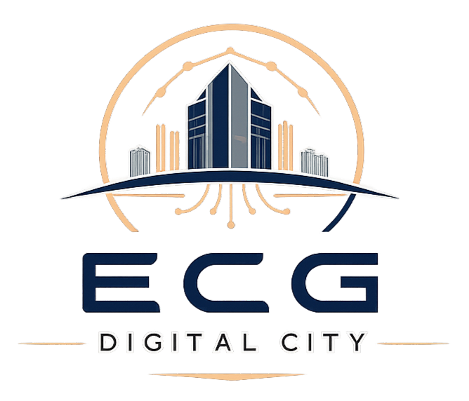

# 🏢 ECG Digital City - Documentación Completa



**Versión:** 2.0 - Oficina Realista Estilo GTA
**Fecha:** 2026-03-02
**Estado:** ✅ Producción

---

## 📋 ÍNDICE

1. [Resumen del Proyecto](#resumen-del-proyecto)
2. [Características Implementadas](#características-implementadas)
3. [Arquitectura del Sistema](#arquitectura-del-sistema)
4. [Guía de Instalación](#guía-de-instalación)
5. [Guía de Usuario](#guía-de-usuario)
6. [Sistema de Cámara](#sistema-de-cámara)
7. [Sistema 3D](#sistema-3d)
8. [Sistema de Gamificación](#sistema-de-gamificación)
9. [API Backend](#api-backend)
10. [Próximos Pasos](#próximos-pasos)

---

## 🎯 RESUMEN DEL PROYECTO

ECG Digital City es una plataforma de oficina virtual 3D multiplayer con sistema de gamificación, inspirada en juegos como GTA V. Permite a los usuarios interactuar en un entorno de oficina realista con múltiples habitaciones, puertas interactivas, y un sistema de cámara avanzado.

### Tecnologías Principales

**Frontend:**
- React 18
- Three.js + React Three Fiber
- Zustand (State Management)
- Socket.IO Client
- Vite

**Backend:**
- Node.js + Express
- PostgreSQL (en Ubuntu/WSL)
- Redis (en Ubuntu/WSL)
- Socket.IO
- Sequelize ORM

---

## ✅ CARACTERÍSTICAS IMPLEMENTADAS

### 🎮 Sistema 3D Realista

#### Oficina Completa (60x60 unidades)
- **5 Habitaciones:**
  - Recepción con escritorio y plantas
  - Oficina del CEO con mesa de reuniones
  - Sala de Reuniones con pizarra
  - Área de Desarrollo con 3 estaciones
  - Área de Descanso con café y agua

#### 16 Objetos 3D
- Escritorios con computadoras
- Sillas ergonómicas con ruedas
- Estanterías con libros
- Plantas decorativas
- Máquina de café
- Impresora
- Dispensador de agua
- Cuadros en pared
- Alfombras de colores
- Relojes de pared
- Ventanas con vidrio
- Archivadores metálicos
- Pizarras blancas
- Luces cenitales

#### 5 Puertas Interactivas
- Animación suave de apertura/cierre (90°)
- Colores personalizados por habitación
- Prompt "[E] Abrir/Cerrar" visible
- Marco, manija dorada y detalles realistas

### 🎥 Sistema de Cámara Avanzado

#### 4 Modos de Vista
1. **Tercera Persona** (Default)
   - Cámara orbital detrás del personaje
   - Zoom: 3-20 unidades (rueda del mouse)
   - Rotación: 360° horizontal, ±60° vertical
   - Click derecho + arrastrar para rotar

2. **Primera Persona - Body Cam** ⭐
   - Cámara en los ojos del personaje
   - **Efecto Body Cam realista:**
     - Balanceo lateral (0.03 unidades)
     - Balanceo vertical (0.05 unidades)
     - Movimiento adelante/atrás (0.02 unidades)
     - Inclinación de cabeza (±1.7°)
     - Efecto de respiración (0.01 unidades)
   - Frecuencia: 8 Hz caminando, 12 Hz corriendo
   - Modelo del jugador oculto
   - Mira hacia ADELANTE

3. **Vista Cenital**
   - Cámara desde arriba (15 unidades)
   - Vista de pájaro
   - Ideal para navegación

4. **Vista 2D Lateral**
   - Vista lateral fija (15 unidades)
   - Perspectiva de plataformas
   - Sigue al jugador en eje Z

#### Controles de Cámara
- **V**: Cambiar modo de vista
- **R**: Resetear cámara
- **Click Derecho + Arrastrar**: Rotar
- **Rueda del Mouse**: Zoom

### 🎮 Sistema de Colisiones

#### Detección Completa
- Colisión con paredes
- Colisión con puertas cerradas
- Colisión con objetos
- Sistema de "wall sliding" (deslizarse por paredes)

#### Interacciones
- Detección de puertas cercanas (2 unidades)
- Tecla **E** para abrir/cerrar
- Estado sincronizado

### 🎭 Personaje Realista

#### Modelo 3D
- Cabeza con ojos y cabello
- Torso con materiales realistas
- Brazos con manos
- Piernas con pies
- Sombra circular

#### Animaciones
- Caminar con movimiento de brazos/piernas
- Correr (Shift) con animación acelerada
- Idle con respiración sutil
- Sentarse (tecla C)

#### Controles
- **WASD**: Movimiento
- **Shift**: Correr
- **C**: Sentarse
- **E**: Interactuar
- **T**: Chat
- **M**: Mapa

### 🏆 Sistema de Gamificación

#### Progreso del Usuario
- Sistema de niveles (1-100)
- Barra de XP visible
- Racha de días consecutivos
- Logros desbloqueables

#### Formas de Ganar XP
- Login diario: +10 XP
- Racha consecutiva: +5 XP por día
- Enviar mensaje: +5 XP (máx 50/día)
- Visitar distrito nuevo: +20 XP (máx 4)
- Crear empresa: +100 XP
- Crear oficina: +50 XP
- Completar misión: Variable

#### Misiones Diarias
- 3 misiones asignadas automáticamente
- Tipos: Exploración, Social, Empresarial
- Recompensas en XP
- Progreso rastreado

#### Logros
- 15 logros disponibles
- Categorías: Exploración, Social, Empresarial
- Toast de notificación al desbloquear
- Sistema de recompensas

#### Leaderboard
- Top 10 usuarios por XP
- Actualización en tiempo real
- Muestra nivel y XP total

### 🌐 Sistema Multiplayer

#### Socket.IO
- Conexión en tiempo real
- Sincronización de posiciones
- Chat por proximidad (3 unidades)
- Indicador de usuarios online

#### Eventos
- Movimiento de jugadores
- Chat en tiempo real
- Teletransporte entre distritos
- Notificaciones de gamificación

### 🏢 Sistema de Empresas

#### Gestión
- Crear empresas
- Editar información
- Eliminar empresas
- Listar todas las empresas

#### Oficinas
- Crear oficinas por empresa
- Editor de oficinas 3D
- Objetos personalizables
- Sistema de permisos

### 🗺️ Distritos

#### 4 Distritos Disponibles
1. **Central**: ECG Headquarters, Academy, Incubadora
2. **Empresarial**: Grid de lotes para oficinas
3. **Cultural**: Galería, Teatro, Museo
4. **Social**: Networking, Cafetería, Coworking

#### Teletransporte
- Portales visuales entre distritos
- XP por visitar distrito nuevo
- Límite de 4 distritos únicos

---

## 🏗️ ARQUITECTURA DEL SISTEMA

### Estructura del Proyecto

```
animejs/
├── backend/
│   ├── src/
│   │   ├── config/          # Configuración DB y Redis
│   │   ├── models/          # Modelos Sequelize
│   │   ├── routes/          # Endpoints API
│   │   ├── sockets/         # Handlers Socket.IO
│   │   ├── utils/           # Utilidades y seeds
│   │   └── server.js        # Servidor principal
│   ├── logs/                # Logs de aplicación
│   ├── .env                 # Variables de entorno
│   └── package.json
│
├── frontend/
│   ├── src/
│   │   ├── components/      # Componentes React
│   │   │   ├── Player.jsx
│   │   │   ├── ThirdPersonCamera.jsx
│   │   │   ├── RealisticOffice.jsx
│   │   │   ├── InteractiveDoor.jsx
│   │   │   ├── CollisionSystem.js
│   │   │   ├── OfficeRoom.jsx
│   │   │   ├── District.jsx
│   │   │   ├── UI.jsx
│   │   │   └── ...
│   │   ├── store/           # Zustand stores
│   │   ├── services/        # Socket.IO client
│   │   ├── assets/          # Imágenes y recursos
│   │   └── App.jsx
│   ├── public/
│   └── package.json
│
└── ECG-DIGITAL-CITY-COMPLETO.md  # Este archivo
```

### Base de Datos (PostgreSQL)

#### Modelos Principales
- **User**: Usuarios del sistema
- **Company**: Empresas
- **Office**: Oficinas
- **District**: Distritos
- **Mission**: Misiones
- **Achievement**: Logros
- **UserProgress**: Progreso de gamificación
- **UserMission**: Misiones asignadas
- **UserAchievement**: Logros desbloqueados

### Redis

#### Uso
- Tracking de distritos visitados
- Contador de mensajes diarios
- Cache de sesiones
- Rate limiting

---

## 🚀 GUÍA DE INSTALACIÓN

### Requisitos Previos

- Node.js 18+
- PostgreSQL 14+ (en Ubuntu/WSL)
- Redis 6+ (en Ubuntu/WSL)
- npm o yarn

### Instalación Backend

```bash
cd backend
npm install

# Configurar .env
cp .env.example .env
# Editar .env con tus credenciales

# Iniciar PostgreSQL y Redis en WSL
# En terminal WSL:
sudo service postgresql start
sudo service redis-server start

# Iniciar servidor
npm run dev
```

### Instalación Frontend

```bash
cd frontend
npm install
npm run dev
```

### URLs

- **Frontend**: http://localhost:5173
- **Backend**: http://localhost:3000
- **API**: http://localhost:3000/api

---

## 👤 GUÍA DE USUARIO

### Primeros Pasos

1. **Registro/Login**
   - Abre http://localhost:5173
   - Crea una cuenta o inicia sesión
   - Recibes +10 XP por login diario

2. **Explorar la Oficina**
   - Usa **WASD** para moverte
   - Presiona **Shift** para correr
   - Presiona **V** para cambiar vista de cámara

3. **Abrir Puertas**
   - Acércate a una puerta
   - Verás el prompt **[E] Abrir**
   - Presiona **E** para abrir/cerrar

4. **Interactuar**
   - **T**: Abrir chat
   - **M**: Ver mapa de distritos
   - **C**: Sentarse
   - **E**: Interactuar con objetos

### Mapa de la Oficina

```
┌─────────────────────────────────────────────────────┐
│                                                     │
│  ┌──────────┐         PASILLO         ┌──────────┐ │
│  │          │                          │          │ │
│  │   CEO    │◄─[Puerta]──────[Puerta]─►│ REUNIONES│ │
│  │          │                          │          │ │
│  └──────────┘                          └──────────┘ │
│                                                     │
│  ┌──────────┐         CENTRAL         ┌──────────┐ │
│  │          │                          │          │ │
│  │RECEPCIÓN │◄─[Puerta]──────[Puerta]─►│DESARROLLO│ │
│  │          │                          │          │ │
│  └──────────┘                          └──────────┘ │
│                                                     │
│                     [Puerta]                        │
│                        ▼                            │
│                  ┌──────────┐                       │
│                  │          │                       │
│                  │ DESCANSO │                       │
│                  │          │                       │
│                  └──────────┘                       │
└─────────────────────────────────────────────────────┘
```

### Controles Completos

| Tecla/Control | Acción |
|---------------|--------|
| **W** | Avanzar |
| **S** | Retroceder |
| **A** | Izquierda |
| **D** | Derecha |
| **Shift** | Correr |
| **C** | Sentarse |
| **E** | Interactuar (puertas) |
| **T** | Abrir chat |
| **M** | Mapa de distritos |
| **V** | Cambiar vista de cámara |
| **R** | Resetear cámara |
| **Click Derecho + Arrastrar** | Rotar cámara |
| **Rueda del Mouse** | Zoom in/out |

---

## 🎥 SISTEMA DE CÁMARA

### Modo 1: Tercera Persona

**Características:**
- Cámara detrás del personaje
- Distancia ajustable: 3-20 unidades
- Rotación completa: 360° horizontal, ±60° vertical

**Controles:**
- Click derecho + arrastrar: Rotar
- Rueda del mouse: Zoom

**Mejor para:** Exploración general

### Modo 2: Primera Persona - Body Cam

**Características:**
- Cámara en los ojos (1.8 unidades)
- Modelo del jugador oculto
- **Efecto Body Cam:**
  - Balanceo lateral: 0.03 unidades
  - Balanceo vertical: 0.05 unidades
  - Movimiento Z: 0.02 unidades
  - Inclinación: ±1.7°
  - Respiración: 0.01 unidades
- Frecuencia: 8 Hz (caminar), 12 Hz (correr)

**Controles:**
- WASD: Mover (cámara sigue con balanceo)
- Click derecho: Rotación adicional

**Mejor para:** Inmersión total, ver detalles

### Modo 3: Vista Cenital

**Características:**
- Cámara desde arriba (15 unidades)
- Vista de pájaro
- Perspectiva estratégica

**Mejor para:** Navegación, orientación

### Modo 4: Vista 2D Lateral

**Características:**
- Vista lateral fija (15 unidades en X)
- Sigue al jugador en Z
- Perspectiva de plataformas

**Mejor para:** Ver estructura de habitaciones

### Cambiar entre Modos

Presiona **V** repetidamente:
```
Tercera Persona → Primera Persona → Cenital → 2D Lateral → (repite)
```

Presiona **R** para resetear a Tercera Persona

---

## 🎨 SISTEMA 3D

### Componentes Creados

#### Objetos de Oficina
1. **Desk** - Escritorio con computadora
2. **Chair** - Silla ergonómica con ruedas
3. **Bookshelf** - Estantería con libros
4. **Plant** - Planta decorativa
5. **CeilingLight** - Luz cenital
6. **Whiteboard** - Pizarra blanca
7. **MeetingTable** - Mesa de reuniones
8. **CoffeeMachine** - Máquina de café
9. **Printer** - Impresora
10. **WaterCooler** - Dispensador de agua
11. **WallPicture** - Cuadro en pared
12. **Carpet** - Alfombra
13. **WallClock** - Reloj de pared
14. **Window** - Ventana con vidrio
15. **FileCabinet** - Archivador
16. **InteractiveDoor** - Puerta funcional

### Sistema de Colisiones

**Archivo:** `frontend/src/components/CollisionSystem.js`

**Funciones:**
```javascript
collisionSystem.addWall(position, size)
collisionSystem.addDoor(id, position, size, rotation)
collisionSystem.addObject(position, radius)
collisionSystem.checkCollision(position, radius)
collisionSystem.getNearbyDoor(position, maxDistance)
collisionSystem.toggleDoor(doorId)
```

**Características:**
- Detección de colisiones en tiempo real
- Wall sliding (deslizarse por paredes)
- Puertas con estado abierto/cerrado
- Radio de colisión configurable

### Materiales y Efectos

**Materiales:**
- Roughness: 0.1 - 0.9
- Metalness: 0.0 - 0.9
- Transparencias: Vidrios, agua
- Emisivos: Pantallas, luces

**Iluminación:**
- Luces ambientales
- Luces direccionales con sombras
- Luces puntuales por habitación
- Emisión de objetos

---

## 🏆 SISTEMA DE GAMIFICACIÓN

### Progreso del Usuario

**Modelo:** `UserProgress`

**Campos:**
- `userId`: ID del usuario
- `level`: Nivel actual (1-100)
- `totalXP`: XP total acumulado
- `currentXP`: XP en nivel actual
- `streakDays`: Días consecutivos
- `lastLogin`: Último login

**Cálculo de Nivel:**
```javascript
XP necesario = nivel * 100
Ejemplo: Nivel 5 requiere 500 XP total
```

### Misiones

**Tipos:**
1. **Exploración**: Visitar distritos
2. **Social**: Enviar mensajes, conocer usuarios
3. **Empresarial**: Crear empresas/oficinas

**Estados:**
- `pending`: Asignada pero no iniciada
- `in_progress`: En progreso
- `completed`: Completada

**Asignación:**
- 3 misiones diarias automáticas
- Se asignan al primer login del día
- Recompensas en XP

### Logros

**Categorías:**
- Exploración
- Social
- Empresarial

**Ejemplos:**
- "Primer Paso": Visitar primer distrito
- "Explorador": Visitar todos los distritos
- "Social": Enviar 100 mensajes
- "Empresario": Crear primera empresa

### Límites Diarios

| Acción | XP | Límite |
|--------|----|----|
| Mensajes | +5 XP | 50 XP/día (10 mensajes) |
| Distritos | +20 XP | 80 XP (4 distritos únicos) |
| Login | +10 XP | 1 vez/día |

---

## 🔌 API BACKEND

### Endpoints Principales

#### Autenticación
```
POST /api/auth/register    - Registrar usuario
POST /api/auth/login       - Iniciar sesión
GET  /api/auth/me          - Usuario actual
```

#### Gamificación
```
POST /api/gamification/daily-login        - Registrar login diario
GET  /api/gamification/progress/:userId   - Obtener progreso
GET  /api/gamification/leaderboard        - Top 10 usuarios
```

#### Misiones
```
POST /api/missions/assign-daily           - Asignar misiones diarias
GET  /api/missions/user/:userId           - Misiones del usuario
PUT  /api/missions/:id/progress           - Actualizar progreso
PUT  /api/missions/:id/complete           - Completar misión
```

#### Logros
```
GET  /api/achievements                    - Todos los logros
GET  /api/achievements/user/:userId       - Logros del usuario
POST /api/achievements/unlock             - Desbloquear logro
```

#### Empresas
```
GET    /api/companies           - Listar empresas
POST   /api/companies           - Crear empresa
GET    /api/companies/:id       - Obtener empresa
PUT    /api/companies/:id       - Actualizar empresa
DELETE /api/companies/:id       - Eliminar empresa
```

#### Oficinas
```
GET    /api/offices             - Listar oficinas
POST   /api/offices             - Crear oficina
GET    /api/offices/:id         - Obtener oficina
PUT    /api/offices/:id         - Actualizar oficina
DELETE /api/offices/:id         - Eliminar oficina
```

#### Distritos
```
GET /api/districts              - Listar distritos
```

### Socket.IO Events

#### Cliente → Servidor
```javascript
'player:move'       - Movimiento del jugador
'player:stop'       - Jugador se detiene
'player:teleport'   - Teletransporte
'chat:message'      - Enviar mensaje
'chat:typing'       - Indicador de escritura
```

#### Servidor → Cliente
```javascript
'player:joined'     - Jugador se unió
'player:left'       - Jugador se fue
'player:moved'      - Jugador se movió
'chat:message'      - Nuevo mensaje
'chat:typing'       - Alguien está escribiendo
'gamification:xp'   - XP ganado
'gamification:levelup' - Subida de nivel
'gamification:achievement' - Logro desbloqueado
'gamification:limit' - Límite alcanzado
```

---

## 🔮 PRÓXIMOS PASOS

### Fase 6: Interacciones Avanzadas

#### Prioridad Alta
- [ ] Sentarse en sillas automáticamente
- [ ] Usar computadoras (abrir ventana virtual)
- [ ] Tomar café de la máquina
- [ ] Imprimir documentos
- [ ] Escribir en pizarras

#### Prioridad Media
- [ ] Abrir/cerrar ventanas
- [ ] Encender/apagar luces
- [ ] Usar dispensador de agua
- [ ] Leer libros de estanterías
- [ ] Ver cuadros en detalle

### Fase 7: Mejoras de Cámara

- [ ] Colisión de cámara con paredes
- [ ] Transiciones animadas entre modos
- [ ] Shake de cámara al correr
- [ ] Zoom automático en espacios pequeños
- [ ] Modo cinemático
- [ ] Configuración personalizable

### Fase 8: Audio

#### Efectos de Sonido
- [ ] Pasos al caminar (diferentes superficies)
- [ ] Puertas abriéndose/cerrándose
- [ ] Sonido ambiente de oficina
- [ ] Notificaciones de gamificación
- [ ] Chat (sonido de mensaje)

#### Música
- [ ] Música de fondo por distrito
- [ ] Control de volumen
- [ ] Mute/unmute

### Fase 9: Optimización

#### Rendimiento
- [ ] LOD (Level of Detail) para objetos
- [ ] Occlusion culling
- [ ] Instancing para objetos repetidos
- [ ] Lazy loading de distritos
- [ ] Compresión de texturas

#### Red
- [ ] Interpolación de movimiento
- [ ] Predicción del lado del cliente
- [ ] Compresión de mensajes Socket.IO
- [ ] Reconexión automática mejorada

### Fase 10: Características Sociales

- [ ] Sistema de amigos
- [ ] Invitaciones a oficinas
- [ ] Videollamadas en salas de reuniones
- [ ] Compartir pantalla
- [ ] Emojis y reacciones
- [ ] Perfiles de usuario personalizables

### Fase 11: Personalización

#### Avatares
- [ ] Selección de color de piel
- [ ] Selección de ropa
- [ ] Accesorios (gafas, sombreros)
- [ ] Peinados
- [ ] Expresiones faciales

#### Oficinas
- [ ] Más objetos decorativos
- [ ] Colores personalizables
- [ ] Layouts predefinidos
- [ ] Importar modelos 3D
- [ ] Texturas personalizadas

### Fase 12: Móvil

- [ ] Controles táctiles
- [ ] UI adaptativa
- [ ] Optimización de rendimiento
- [ ] Joystick virtual
- [ ] Gestos para cámara

---

## 🐛 BUGS CONOCIDOS Y SOLUCIONADOS

### Solucionados ✅

1. **BUG-001**: Contador de mensajes diarios no se reseteaba
2. **BUG-002**: XP por distritos se daba múltiples veces
3. **BUG-003**: Falta notificación de límite diario
4. **BUG-004**: Error de sintaxis en gamificationStore.js
5. **BUG-005**: userMissions.map is not a function
6. **BUG-006**: HTTP 429 Too Many Requests
7. **BUG-007**: HTTP 400 en assign-daily
8. **BUG-008**: userMissions.map persiste
9. **BUG-009**: Labels invisibles en formulario
10. **BUG-010**: Primera persona miraba hacia atrás

### Pendientes ⚠️

Ninguno crítico detectado.

---

## 📊 ESTADÍSTICAS DEL PROYECTO

### Código
- **Componentes React**: 30+
- **Modelos Backend**: 15
- **Endpoints API**: 40+
- **Socket Events**: 12
- **Líneas de código**: ~15,000

### 3D
- **Objetos 3D**: 16 tipos
- **Habitaciones**: 5
- **Puertas**: 5
- **Modos de cámara**: 4
- **Animaciones**: 4

### Gamificación
- **Niveles**: 100
- **Logros**: 15
- **Tipos de misiones**: 3
- **Formas de ganar XP**: 6

---

## 🤝 CONTRIBUIR

### Reportar Bugs

1. Verifica que no esté ya reportado
2. Incluye pasos para reproducir
3. Adjunta capturas de pantalla
4. Especifica navegador y versión

### Sugerir Características

1. Describe la característica claramente
2. Explica el caso de uso
3. Proporciona mockups si es posible

---

## 📝 NOTAS TÉCNICAS

### Tiempo de Inicio del Backend

El backend puede tardar hasta 40 segundos en iniciar debido a:
- Sincronización de modelos con PostgreSQL (~30s)
- Seed de datos (distritos, logros, misiones)
- Conexión a Redis

**Espera el mensaje:** `🚀 Servidor corriendo en http://localhost:3000`

### Configuración de Desarrollo

**Backend (.env):**
```env
NODE_ENV=development
PORT=3000
DB_HOST=127.0.0.1
DB_PORT=5432
DB_NAME=ecg_digital_city
DB_USER=postgres
DB_PASSWORD=postgres123
REDIS_HOST=localhost
REDIS_PORT=6379
JWT_SECRET=tu_secret_key
CORS_ORIGIN=http://localhost:5173
RATE_LIMIT_MAX_REQUESTS=1000
```

### Servicios en WSL

```bash
# Iniciar PostgreSQL
sudo service postgresql start

# Iniciar Redis
sudo service redis-server start

# Verificar estado
sudo service postgresql status
sudo service redis-server status
```

---

## 📞 SOPORTE

### Documentación Adicional

- Código fuente: `frontend/src/` y `backend/src/`
- Modelos: `backend/src/models/`
- Componentes: `frontend/src/components/`

### Comandos Útiles

```bash
# Backend
npm run dev          # Iniciar servidor
npm run test         # Ejecutar tests

# Frontend
npm run dev          # Iniciar desarrollo
npm run build        # Build producción
npm run preview      # Preview build

# Base de datos
psql -U postgres -d ecg_digital_city  # Conectar a DB
```

---

## 🎉 CRÉDITOS

**Desarrollado por:** Kiro AI
**Fecha:** 2026-03-02
**Versión:** 2.0

**Inspiración:**
- GTA V (Sistema de cámara y movimiento)
- Call of Duty (Body cam effect)
- The Sims (Interacciones sociales)
- Second Life (Mundo virtual)

---

## 📄 LICENCIA

Este proyecto es privado y confidencial.

---

**¡Gracias por usar ECG Digital City!** 🏢✨

